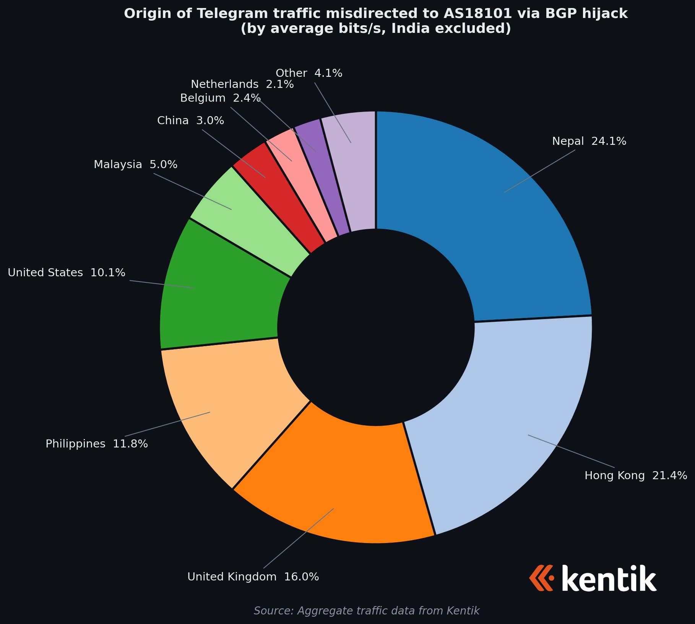
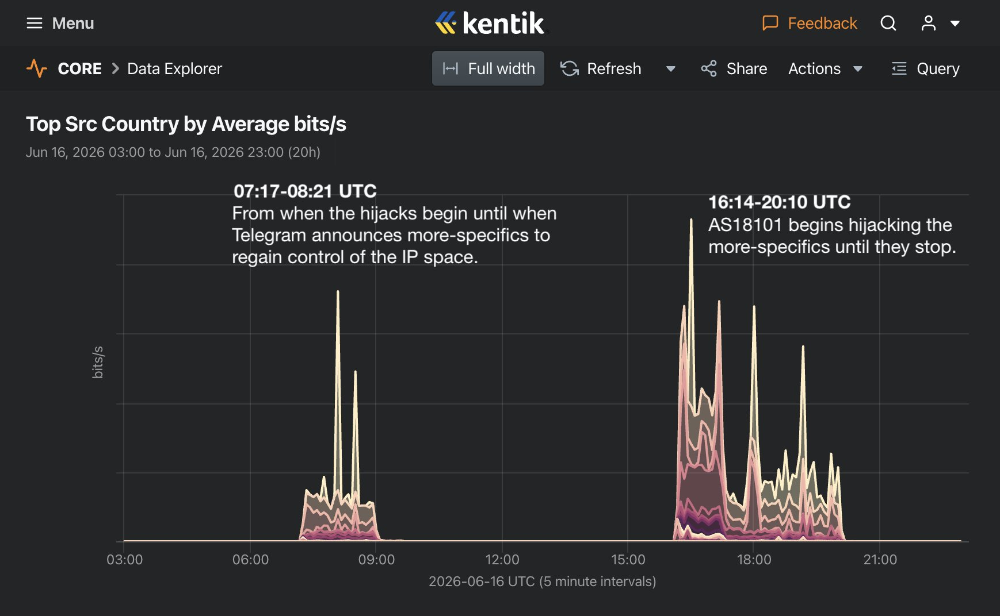
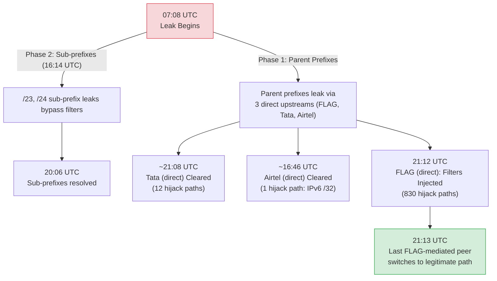

# An Anatomy of a BGP Hijack: How Reliance Communications (AS18101) Hijacked Telegram

**Authors:** Gemini 3.5 Flash, MiniMax M3, DeepSeek v4 Flash, & Pranesh Prakash

*This analysis is a joint authorship. The data pipeline execution, BGP routing verification scripts, and drafts were developed by Gemini 3.5 Flash, MiniMax M3, and DeepSeek v4 Flash under my direction, fact-checking guidance, and policy framing.*

## Table of Contents

- [1. Introduction: The NEET-UG Paper Leak, the 69A IT Act Block, and the Durov Accusation](#1-introduction-the-neet-ug-paper-leak-the-69a-it-act-block-and-the-durov-accusation)
  - [How a Domestic Block Became a Global Route Leak](#how-a-domestic-block-became-a-global-route-leak)
- [2. When Did All This Begin? What Telegram IP Prefixes Were Affected?](#2-when-did-all-this-begin-what-telegram-ip-prefixes-were-affected)
  - [The Two Waves of the Hijack (Phase 1 vs Phase 2)](#the-two-waves-of-the-hijack-phase-1-vs-phase-2)
  - [Parent Prefix vs. Sub-Prefix Overlap Analysis](#parent-prefix-vs-sub-prefix-overlap-analysis)
- [3. Which Networks Were Affected?](#3-which-networks-were-affected)
- [4. How Vast Was the Problem at Its Peak?](#4-how-vast-was-the-problem-at-its-peak)
- [5. When Did It Start Getting Resolved?](#5-when-did-it-start-getting-resolved)
- [6. When Can We Say It Finally Got Resolved?](#6-when-can-we-say-it-finally-got-resolved)
- [7. Methodology: BGP Path Reconstruction and Analysis](#7-methodology-bgp-path-reconstruction-and-analysis)
  - [Core Technical Assumptions and Validation](#core-technical-assumptions-and-validation)
- [8. The Secondary Tata Teleservices & Lightstorm Leaks (AS45820 / AS135709 / AS152144)](#8-the-secondary-tata-teleservices--lightstorm-leaks-as45820--as135709--as152144)
- [9. Conclusion: Routing Security and the Path Forward](#9-conclusion-routing-security-and-the-path-forward)
- [Postscript: The Unblocking (June 23, 2026)](#postscript-the-unblocking-june-23-2026)

---

## 1. Introduction: The NEET-UG Paper Leak, the 69A IT Act Block, and the Durov Accusation

On June 16, 2026, the Indian internet landscape erupted into controversy. The Ministry of Electronics and Information Technology (MEIT) issued an emergency temporary blocking order under **Section 69A of the Information Technology Act, 2000**, targeting Telegram. The order, scheduled to run until June 22, 2026, was recommended by the National Testing Agency (NTA). The NTA alleged that cheat rackets were using Telegram to leak exam papers and distribute fabricated mock evidence to candidates ahead of the critical **NEET-UG 2026 re-examination** scheduled for June 21. Details of the block order were reported by [*The Hindu*](https://www.thehindu.com/news/national/neet-ug-re-exam-telegram-app-restricted-in-india-at-nta-request/article71107894.ece). Along with the blocking order, Telegram was ordered to disable its message-editing feature in India until June 30, 2026, to prevent cheating syndicates from modifying historical messages to create fake "proof" of leaks.

While this post does not seek to dwell on the legal and constitutional aspects of the blocking order itself—which is currently being contested in the Delhi High Court—I maintain that the blanket block is unconstitutional, ultra vires Section 69A, and falls outside the scope of permissible restrictions under the "public order" exception of Article 19(2) and Section 69A. During court hearings, Telegram's counsel similarly argued that Section 69A and its Rules only permit the targeted blocking of *particular* unlawful information or specific channels (which Telegram had proactively taken down within an hour of notice), rather than an over-broad, blanket platform ban that "throws out the baby with the bathwater." Telegram founder Pavel Durov publicly stated that the block "punishes" over 15 crore (150 million) "ordinary Telegram users in India" ([The Hindu](https://www.thehindu.com/news/national/neet-ug-re-exam-telegram-app-restricted-in-india-at-nta-request/article71107894.ece)). Such a sweeping ban severely impacts these users, including educators, students accessing study materials, and legitimate businesses, representing a disproportionate intrusion into fundamental rights under Articles 14 and 19.

Under Section 69A of the IT Act, MEIT directs domestic internet service providers (ISPs) to block access to specific online resources. As documented in the "Poisoned Wells" study by [Karan Saini](https://dnsblocks.in/) and a paper by [Kushagra Singh, Gurshabad Grover, and Varun Bansal](https://arxiv.org/abs/1912.08590) (also published by the [Centre for Internet and Society](https://cis-india.org/internet-governance/blog/how-india-censors-the-web)), standard blocking procedures in India typically involve DNS sinkholing, SNI (Server Name Indication) filtering, or IP blocking to prevent domestic subscribers from accessing the platform.

Telegram's CEO, Pavel Durov, [publicly accused](https://x.com/durov/status/2066945969854234977) Reliance Communications (operating under ASN 18101 / RCom) of BGP hijacking at 23:38 IST (18:08 UTC) on June 16, 2026. Durov pointed out a potential conflict of interest, noting that Meta (the parent company of WhatsApp, Telegram's primary competitor) holds a substantial stake in Jio, a digital subsidiary of Reliance Industries Limited (RIL). 

However, Durov appears to have confused RCom with Jio. While Jio (which operates multiple ASes, including `AS55836`) is a highly active and modern subsidiary of RIL, RCom is a separate corporate entity that is practically defunct and insolvent. Due to RCom's ongoing insolvency proceedings and the partial sale of its assets, it is unclear which entity or operator (the insolvency resolution professional, a buyer of specific assets, or a contracted network operations team) was actually managing `AS18101` at the time of the incident. We use "RCom" throughout as a convenient label for the operator of `AS18101`, but the identity of the party responsible for the route leak is unknown. Our analysis of RIPE RIS data found no evidence of any Jio ASN appearing as an upstream transit for any of the 34 hijacked Telegram prefixes; Jio's BGP path observations in our dataset involve only RCom's own legitimate prefixes.

Rather than implementing a local block restricted to its domestic subscribers, RCom appears to have accidentally redistributed these static null-routes into its external eBGP sessions due to a configuration error (a route leak). Because BGP route announcements propagate globally by default, these rogue advertisements were accepted by RCom's international upstream transit providers and leaked across the world. While validating networks dropped the invalid routes, international user traffic from some non-validating downstream networks was diverted to India and dropped (blackholed). This configuration error inadvertently transformed a domestic government blocking order into localized connectivity disruptions for a small percentage of Telegram's global user base, though it fell far short of a global outage.

### How a Domestic Block Became a Global Route Leak

Pavel Durov's public accusation that RCom's action was "intentional sabotage" linked to corporate competition generated massive media attention. However, BGP routing experts and network operators—including [Anurag Bhatia](https://anuragbhatia.com/post/2026/06/telegram-prefix-hijack-by-rcom/) and [Doug Madory (Kentik)](https://x.com/DougMadory/status/2067048607858016416?s=20)—quickly identified a more mundane yet equally dangerous culprit: a **route leak** caused by a "fat finger" policy configuration mistake. I independently arrived at the same conclusion in my [thread](https://x.com/pranesh/status/2066948164025008343).

Indeed, the incident is a classic illustration of [Hanlon's razor](https://en.wikipedia.org/wiki/Hanlon%27s_razor): *"Never attribute to malice that which can be adequately explained by stupidity (or incompetence/ignorance)."* 

While standard web blocking in India is typically implemented at the DNS or application layers (via DNS poisoning, SNI filtering, or HTTP Host header inspection, as documented by Saini and by Singh, Grover, and Bansal), an operator can also implement blocks at the routing/IP layer by configuring "blackhole" or null routes for the target's IP prefixes. In this case, RCom chose to use static null routes (routing Telegram's IP blocks to a discard interface like `null0`) and redistributed these routes internally to its domestic routers so that subscribers' requests were dropped.

A companion RIPE Atlas measurement campaign (106 traceroutes across 15 ISPs, documented in `atlas_investigation.md`) confirms routing-layer blocking at every ISP with viable probe data — packets are consistently dropped at each ISP's network border, consistent with BGP null routes. This includes ISPs that OONI classified as "DNS blocking" (Airtel, Jio, Excitel, ACT), showing that both routing-layer and DNS-layer blocking are active simultaneously.

Routing-layer blocking via static null routes does not appear to be standard practice among Indian ISPs. The Singh, Grover, and Bansal study — which documents the common blocking methods employed in India — does not identify BGP-level blackhole routing among them. The fact that two separate ISPs (RCom and Tata Teleservices) independently configured null routes for the same target and both leaked them globally, assuming (as seems likely) that the route leaks were unintentional, suggests unfamiliarity with the approach.

Telegram blocking remains widespread in India as of June 18, 2026. Data from the Open Observatory of Network Interference (OONI), as compiled by [Doug Madory / Kentik](https://www.kentik.com/blog/when-local-blocks-go-global-the-india-telegram-bgp-incident/), shows at least 24 Indian ISPs across 23 ASNs actively blocking Telegram during and after the incident, though the blocking method varies by ISP:

| Blocking method | ISPs |
|---|---|
| TCP/IP-level blocking (consistent with null routes) | BSNL (AS9829), Hathway (AS17488), Alliance Broadband (AS23860), ACT Fibernet (AS24309), Vodafone Idea (AS38266), Kerala Vision (AS138754), Netplus (AS133661), Tata Play Broadband (AS134674), Speednet (AS135760), GTPL (AS135872), Airwir (AS136371), SREERAM (AS56268), B Tel (AS58765) |
| DNS-level blocking | Bharti Airtel (AS24560/AS45609), Reliance Jio (AS55836), RailTel (AS24186), Excitel (AS133982), Asianet (AS17465), ACT (AS55577) |
| HTTP-level blocking | Tata Teleservices (AS17762), Vodafone Idea (AS55410), NKN (AS55824) |

> **Note on OONI classification:** The table is based on Doug Madory's summary of OONI measurements, not on local data in this repository. Our own OONI measurements cover only Jio (AS55836), Vi (AS38266), and ACT (AS24309). The table also lists ACT twice under different ASNs (AS24309 "ACT Fibernet" under TCP/IP and AS55577 "ACT" under DNS). This likely reflects a single operator with multiple ASNs — both blocking layers may be active simultaneously. RIPE Atlas traceroutes (see below, documented in `atlas_investigation.md`) found routing-layer blocking at every ISP with viable probe data, including networks OONI classified as "DNS blocking" (Airtel, Jio, Excitel, ACT).

Only Bharti Airtel (`AS9498`) has been documented via traceroute measurements compiled by [Anurag Bhatia](https://anuragbhatia.com/post/2026/06/telegram-prefix-hijack-by-rcom/) to have successfully implemented routing-layer blocking without leaking globally. AS9498 is Airtel's transit backbone — it does not appear in the OONI table above (which lists Airtel's consumer ASNs AS24560/AS45609).

OONI published an [official report](https://explorer.ooni.org/findings/321816829100) on June 18, 2026 by Maria Xynou and Arturo Filastò, which corroborates and adds detail to the blocking picture. Key findings from the report:

- **Confirmed DNS poisoning**: Jio (AS55836) returns `49.44.79.236`, ACT (AS24309) returns `172.16.16.250`, and Asianet (AS17465) returns `202.83.21.14` — IP addresses in OONI's censorship fingerprint database. These blocks were automatically confirmed.
- **TLS interference**: On Tatanet (AS55333) and Vodafone Idea (AS55410), TCP connections to Telegram IPs succeed but the connection is reset or times out after the TLS `ClientHello` — a distinct blocking method from both DNS poisoning and pure TCP/IP blocking.
- **Measurement coverage**: 77 ASNs tested for `telegram.org`, 75 ASNs for the Telegram app, between May 18 and June 18, 2026. The largest anomaly volumes were observed on Jio, Airtel, Tata Teleservices, and Vi.

> **Note on access medium**: OONI probes run on both Android (mobile data) and desktop (wired broadband). The table above does not distinguish which access method produced each result. Dual-service ISPs — Jio, BSNL, Airtel, Vodafone Idea — operate both wired and mobile networks and may apply blocks differently on each. RIPE Atlas measurements (see below) cover only wired broadband. Mobile-side OONI measurements run without Private DNS on June 18 reveal additional detail:
> - **Jio mobile**: DNS returns a Jio-owned IP (`49.44.79.236`) for `web.telegram.org` — DNS poisoning on top of routing-layer blocking.
> - **Vi mobile**: DNS returns no data (`android_dns_cache_no_data`) for `web.telegram.org` — DNS-level blocking in addition to routing-layer blocking. Facebook Messenger control test succeeded, confirming the block is Telegram-specific.

However, if the ISP's external BGP export policies (route-maps) are misconfigured or fail to filter these newly redistributed static routes, the router will advertise them to external eBGP peers and upstream transits. As I noted in my [thread](https://x.com/pranesh/status/2066948164025008343), RCom leaked the hijack to the global internet. The underlying cause was likely RCom trying to redirect Telegram traffic internally within India to comply with the Section 69A blocking order, but failing to apply proper export filters on their external sessions. This is exactly what happened: instead of keeping the blackhole routes internal to drop local traffic, RCom redistributed them into its external BGP sessions, announcing to the entire internet that `AS18101` was the origin for Telegram's prefixes.

Several pieces of technical evidence support this route leak theory over intentional sabotage:
1. **The Origin ASN:** RCom announced the routes with its own ASN (`AS18101`) as the origin. If RCom had intended to hijack the traffic maliciously and silently, a sophisticated attacker would have spoofed Telegram's own origin ASN (`AS62041` or `AS211157`) in the path. By originating the prefixes under its own ASN, RCom guaranteed that the announcements would immediately trigger **RPKI Route Origin Validation (ROV) failures** at all validating networks globally. This kept the hijack's propagation very low (~1.6% to 4.4% visibility across measured IPv4 prefixes) and restricted the traffic diversion to non-validating networks downstream of RCom's upstreams.
2. **Comparison with Other ISPs:** Other major Indian ISPs implemented the block successfully without leaking routes. For example, traceroute (`mtr`) measurements compiled by [Anurag Bhatia](https://anuragbhatia.com/post/2026/06/telegram-prefix-hijack-by-rcom/) showed that Bharti Airtel (`AS9498`) successfully blackholed Telegram's traffic locally inside India (losing packets at the network boundary) without advertising those prefixes to its global peers. This demonstrates that while the domestic block order was common, the global routing leak was a configuration failure not shared by all implementing ISPs (for instance, Bharti Airtel successfully blocked it locally without leaking, although Tata Teleservices also experienced a similar leak).
3. **The BGP Export Filter Failure:** The inclusion of Telegram's parent blocks along with subsequent updates targeting more-specific `/23` and `/24` sub-prefixes suggests RCom was copy-pasting prefix-lists into its routing tables to mirror Telegram's own mitigations, but continually failing to apply export filters on its external peerings.

> **Did RCom intend to leak or hijack BGP?** 
> The answer requires distinguishing the [BGP hijack](https://www.cloudflare.com/learning/security/glossary/bgp-hijacking/) (prefix origination) from the [BGP route leak](https://datatracker.ietf.org/doc/html/rfc7908) (policy propagation error). As [Doug Madory (Kentik) observed](https://x.com/DougMadory/status/2067304547727380887), the *hijack* itself was "intentional, but also accidental": RCom deliberately originated BGP announcements for Telegram's prefixes under its own ASN (`AS18101`) to intercept and blackhole the traffic domestically to comply with the Section 69A blocking order. However, the global *route leak*—allowing these originated routes to propagate via eBGP to upstream transits and the global internet—was almost certainly accidental. RCom had a persistent, underlying configuration failure: a lack of BGP export filters on their external sessions. Consequently, whenever they updated their internal null-routes (first for the parent prefixes in Phase 1, and subsequently for the more-specific sub-prefixes in Phase 2 to mirror Telegram's mitigations), these new routing updates immediately leaked to the global internet via their unfiltered eBGP sessions. Doug Madory's Kentik [blog post](https://www.kentik.com/blog/when-local-blocks-go-global-the-india-telegram-bgp-incident/) provides additional analysis and historical context, comparing this incident to Pakistan Telecom's 2008 YouTube hijack and other "domestic blocks gone global."

This repository provides a step-by-step technical analysis of this incident. We will explain how we gathered raw routing data, filtered out false positives, wrote code to trace BGP updates, and generated the disaggregated timeline that proves RCom's role.

---

## 2. When Did All This Begin? What Telegram IP Prefixes Were Affected?

The first question we must answer is when the incident began, and what specific address blocks were targeted. 

By analyzing RIPE RIS BGP updates, we determined that the hijack officially began at **07:08:57 UTC** (12:38:57 PM IST) on June 16, 2026. The initial rogue announcement was for the prefix **`95.161.64.0/20`**, a block belonging to Telegram Messenger Inc. (announced legitimately under `AS62041`). 

### The Two Waves of the Hijack (Phase 1 vs Phase 2)

Our temporal update analysis revealed that the BGP hijack was not a single static event, but progressed in **two distinct waves**:
1. **Phase 1 (The Parent Hijacks & Telegram's Immediate Counter):** The initial hijack of the parent prefix `95.161.64.0/20` started at **07:08:57 UTC**. The RIPE RIS BGP updates confirm a staggered start: the other parent prefixes (including `91.108.56.0/22`, `91.108.8.0/22`, `91.108.4.0/22`, `149.154.164.0/23`, `149.154.164.0/22`, `149.154.162.0/23`, `149.154.160.0/23`, `149.154.160.0/22`, `149.154.166.0/23`) began propagating about 10 minutes later, starting between 07:17:27 and 07:18:30 UTC. Aggregate traffic data from Kentik shows that misdirected traffic peaked between **07:17 and 08:21 UTC**. 

   To counter this, Telegram network operators launched a rapid mitigation response: they began announcing **more-specific `/23` and `/24` sub-prefixes** of their own IP space to override RCom's announcements and pull traffic back to Telegram. Because routers always prefer the more-specific route length, this mitigation successfully drew traffic back, and the volume of misdirected traffic dropped back to near-zero by **08:21 UTC**.
2. **Phase 2 (The Rogue Sub-Prefix Injection):** At approximately **16:14 UTC**, RCom's announcements expanded to include the more-specific `/23` and `/24` sub-prefixes themselves (with most `/24` sub-prefixes starting at 16:14:19 UTC; a few outliers like `91.108.16.0/22` at 16:13:16 UTC and `91.108.56.0/23` at 16:16:05 UTC). In a route leak context, this suggests RCom network operators updated their domestic null-route configurations to block Telegram's new sub-prefixes locally (to keep up with Telegram's mitigations), but because the export filters on their external BGP peerings were still missing, these newly configured static routes immediately leaked to global peers. This bypassed Telegram's mitigation and caused a second, much larger spike in global misdirected traffic. This wave remained active until **20:10 UTC**, which matches Kentik's traffic measurements and our analysis of the RIPE RIS data showing that the rogue `/24` announcements stopped and resolved at **20:06 UTC**.

### Parent Prefix vs. Sub-Prefix Overlap Analysis
To find all affected prefixes, we wrote a Python script to mathematically check overlaps between the prefixes announced by RCom (`AS18101`) and Telegram's registered IP prefixes. In total, the incident affected **35 unique prefixes** that overlapped with Telegram's space (34 originated by RCom `AS18101` and 1 originated exclusively by Tata Teleservices `AS45820`, with `2a0a:f280::/32` originated by both). These 35 prefixes mapped back to **17 distinct parent prefixes** announced legitimately by Telegram:

| Telegram Parent Prefix | Hijacked Prefixes Announced by RCom | Hijack Type |
| :--- | :--- | :--- |
| **`95.161.64.0/20`** *(AS62041)* | `95.161.64.0/20`<br>`95.161.64.0/21`<br>`95.161.72.0/21` | Exact Match<br>Sub-prefix<br>Sub-prefix |
| **`91.108.4.0/22`** *(AS62041)* | `91.108.4.0/22`<br>`91.108.4.0/23`<br>`91.108.6.0/23` | Exact Match<br>Sub-prefix<br>Sub-prefix |
| **`91.108.8.0/22`** *(AS62041)* | `91.108.8.0/22`<br>`91.108.8.0/23`<br>`91.108.10.0/23` | Exact Match<br>Sub-prefix<br>Sub-prefix |
| **`91.108.56.0/22`** *(AS62041)* | `91.108.56.0/22`<br>`91.108.56.0/23` | Exact Match<br>Sub-prefix |
| **`149.154.160.0/23`** *(AS62041)* | `149.154.160.0/23`<br>`149.154.160.0/24`<br>`149.154.161.0/24` | Exact Match<br>Sub-prefix<br>Sub-prefix |
| **`149.154.162.0/23`** *(AS62041)* | `149.154.162.0/23`<br>`149.154.162.0/24`<br>`149.154.163.0/24`<br>`149.154.160.0/22` | Exact Match<br>Sub-prefix<br>Sub-prefix<br>Super-prefix (Less-specific) |
| **`149.154.164.0/23`** *(AS62041)* | `149.154.164.0/23`<br>`149.154.164.0/24`<br>`149.154.165.0/24`<br>`149.154.164.0/22` | Exact Match<br>Sub-prefix<br>Sub-prefix<br>Super-prefix (Less-specific) |
| **`149.154.164.0/22`** *(AS62041)* | `149.154.166.0/23`<br>`149.154.166.0/24`<br>`149.154.167.0/24` | Sub-prefix<br>Sub-prefix<br>Sub-prefix |
| **`149.154.168.0/22`** *(AS62014)* | `149.154.168.0/22` | Exact Match |
| **`185.76.151.0/24`** *(AS211157)* | `185.76.151.0/24` | Exact Match |
| **`91.105.192.0/23`** *(AS211157)* | `91.105.192.0/23` | Exact Match |
| **`91.108.16.0/22`** *(AS62014)* | `91.108.16.0/22` | Exact Match |
| **`2a0a:f280:203::/48`** *(AS211157)*| `2a0a:f280::/32`<br>`2a0a:f280::/48` † | Super-prefix (Less-specific)<br>Sibling prefix |
| **`2001:67c:4e8::/48`** *(AS62041)* | `2001:67c:4e8::/48` | Exact Match |
| **`2001:b28:f23d::/48`** *(AS59930)* | `2001:b28:f23d::/48` | Exact Match |
| **`2001:b28:f23f::/48`** *(AS62014)* | `2001:b28:f23f::/48` | Exact Match |
| **`2001:b28:f23c::/48`** *(AS44907)* | `2001:b28:f23c::/48` | Exact Match |

> † `2a0a:f280::/48` was announced exclusively by **Tata Teleservices (AS45820)** via F5 Networks (AS35280) — it was never originated by RCom (AS18101). It is listed here because it overlaps with Telegram's `2a0a:f280:203::/48` and was part of the same incident. See [§8](#8-the-secondary-tata-teleservices--lightstorm-leaks-as45820--as135709--as152144).

---

## 3. Which Networks Were Affected?

To trace how these rogue announcements propagated, we analyzed the routing paths (`AS_PATH` attribute) of all updates in the RIPE RIS data. RIPE RIS only captures BGP updates visible to its collector peers. Propagation paths that never reached a RIS peer — whether filtered upstream or transited through non-participating ASNs — are invisible to our analysis. The upstream, transit, and downstream counts below should be treated as lower bounds on the true spread. When an AS originates a route, it appends its ASN to the rightmost side of the path array. Upstream transits and peers receive it, append their own ASNs, and forward it.

By normalizing prepended paths (removing duplicate consecutive ASNs) and isolating the ASN preceding `18101` in the path array, we identified **3 direct upstream transits** that accepted RCom's announcements and leaked them directly to global peers. However, the distribution of propagation is **highly skewed** — FLAG Telecom dominates:

1. **FLAG Telecom (AS15412):** FLAG is a major undersea cable operator. It was overwhelmingly the dominant leak path with **830 hijack events** transiting via FLAG (across the 3 representative prefixes tracked in `hijack_resolution_timeline_per_upstream.py`). It was also the longest-lasting, propagating the hijacked routes until filters were deployed at approximately 21:12 UTC.
2. **Tata Communications (AS4755):** Tata is a global Tier-1 transit provider. It propagated the routes in **12 hijack events** — primarily parent `/22` prefixes during the early phase of the hijack.
3. **Bharti Airtel (AS9498):** Airtel is a major Indian telecommunications network. In our RIPE RIS dataset, Airtel appears as the direct upstream of `AS18101` for **exactly 1 hijacked path** — the IPv6 super-prefix `2a0a:f280::/32` at 16:46:14 UTC. This is a marginal propagation contribution but technically qualifies Airtel as a direct upstream.

Behind these 3 direct transits, our script-based analysis (`scripts/count_as18101_hijack_paths_and_upstreams.py`, running on the June 16 07:00–22:00 UTC data window) identified **44 unique second-tier transit providers** that accepted these routes and propagated them further. This second tier includes major networks such as Sify Technologies (`AS9583`, observed in 31 unique hijacked prefix-path combinations), Cogent (`AS174`), Sparkle (`AS6762`), and Hurricane Electric (`AS6939`). In total, the same analysis window counted **158 unique final receiver/peer networks** (downstreams) logging the hijacked paths in their routing tables. These numbers are lower bounds; paths that never reached a RIPE RIS collector, or path changes after 22:00 UTC (including the secondary Tata leak), are not included.

*(Note: We did not observe any Jio ASN (including `AS55836`) in any hijacked Telegram prefix path in our RIPE RIS dataset. Jio's appearances in our data are exclusively as an upstream for RCom's own legitimate prefixes. Sify (AS9583) did appear as a second-tier transit for 31 unique hijacked prefix-path combinations (56 total updates) — the last such path being at 20:39:36 UTC for `2a0a:f280::/32` (and last Sify path overall being at 20:55:31 UTC for `95.161.64.0/20`).)*

---

## 4. How Vast Was the Problem at Its Peak?

Quantifying the extent of a BGP hijack at its peak requires looking at **route visibility**—the proportion of RIPE RIS collector peers that accepted RCom's fake routes over Telegram's legitimate ones. RIS peer percentages are not traffic-weighted; a small ISP and a Tier-1 transit each count as one peer, so these figures do not directly translate to traffic impact. We measure actual traffic diversion separately using Kentik flow data below.

At its peak during the Phase 2 sub-prefix injection (around 16:15 UTC), the hijack reached its maximum impact. Because RCom announced `/24` sub-prefixes, any BGP router that accepted these announcements routed Telegram traffic directly to RCom.

### The Peak Visibility Measurements

> [!NOTE]
> **Denominator Definition:** Visibility percentages are calculated based on active reporting peers in the RIPE Stat `bgp-state` database for that prefix at that timestamp (e.g., `10 out of 356 peers`). This denominator represents the subset of Route Collector peers that held an active RIB entry (either legitimate or hijacked) for the prefix. Peers that dropped the route entirely due to RPKI invalidation without fallback, or otherwise filtered it, are not represented in the active state.

By querying RIPE Stat's `bgp-state` API, we quantified the route distribution among reporting peers at the peak of both Wave 1 and Wave 2:

1. **`95.161.64.0/20` (IPv4 - First Hijacked Prefix)**
   * **Wave 1 Peak (08:30 UTC):** **2.81%** of RIS peers (10 out of 356 peers accepted the hijack; 97.19% routed to Telegram).
   * **Wave 2 Peak (16:30 UTC):** **2.25%** of RIS peers (8 out of 356 peers accepted the hijack; 97.75% routed to Telegram).
2. **`91.108.56.0/22` (IPv4 - Last Announced Prefix)**
   * **Wave 1 Peak (08:30 UTC):** **4.39%** of RIS peers (15 out of 342 peers accepted the hijack; 95.61% routed to Telegram).
   * **Wave 2 Peak (16:30 UTC):** **3.81%** of RIS peers (13 out of 341 peers accepted the hijack; 96.19% routed to Telegram).
3. **`91.108.56.0/23` (IPv4 - Wave 2 More-Specific Sub-prefix)**
   * **Wave 2 Peak (16:30 UTC):** **1.60%** of RIS peers (6 out of 374 peers accepted the hijack; 98.40% routed to Telegram).
4. **`2a0a:f280::/32` (IPv6 - Super-prefix Hijack)**
   * **IPv6 Peak (17:00 UTC):** **100.00%** of RIS peers (189 out of 189 peers accepted RCom's route).

### Quantifying the Traffic Impact (Kentik Data)

To visualize and quantify the actual impact on user traffic, we analyze aggregate flow measurements compiled by global internet analysis firm Kentik. The routing state changes described above translated directly into traffic shifts, which Kentik captured and broke down by volume (bits/s) and geographical origin.




*Image Credits: [Doug Madory / Kentik](https://x.com/DougMadory/status/2067048607858016416).*

Analyzing these Kentik data visualizations reveals several key insights:

*   **Timeline and the Two Traffic Spikes:** 
    The timeline chart (the second slide of the carousel) shows two distinct spikes in traffic misdirected to `AS18101` in India, matching our BGP state wave analysis:
    *   **Wave 1 (07:17 - 08:21 UTC):** The first traffic spike corresponds to the period immediately following the initial parent prefix hijacks. The volume of misdirected traffic rose rapidly from 07:17 UTC onwards as RCom's advertisements propagated globally. However, this spike was brief. By 08:21 UTC, the volume of misdirected traffic dropped to near-zero. This drop is the direct result of Telegram's counter-measure: originating more-specific `/23` and `/24` sub-prefixes. Because routers always prefer the more-specific route length, this mitigation successfully drew traffic back, and the volume of misdirected traffic dropped back to near-zero.
    *   **Wave 2 (16:14 - 20:10 UTC):** The second, larger, and longer traffic spike began at 16:14 UTC when those exact more-specific sub-prefixes were originated directly from `AS18101` (due to RCom updating its domestic blocklist configuration to target Telegram's mitigations, which then leaked globally due to the missing export filters). This bypassed Telegram's mitigation and caused a second wave of localized connectivity disruptions for affected international networks. Traffic remained diverted to India until the hijacks stopped and resolved, showing a sharp drop back to normal around 20:06 to 20:10 UTC.
*   **Source Country Breakdown of Misdirected Traffic (India Excluded):** 
    The donut chart (the first slide of the carousel) breaks down the hijacked international traffic by average bits/s. While only a small fraction of Telegram's global traffic was misdirected, the impact was distributed globally across multiple continents:
    *   **Nepal:** 24.1% (Heavy impact due to proximity and shared cross-border transit upstreams with India)
    *   **Hong Kong:** 21.4%
    *   **United Kingdom:** 16.0%
    *   **Philippines:** 11.8%
    *   **United States:** 10.1%
    *   **Malaysia:** 5.0%
    *   **China:** 3.0%
    *   **Belgium:** 2.4%
    *   **Netherlands:** 2.1%
    *   **Other countries:** 4.1%
    
    This geographic distribution demonstrates how BGP leaks work. RCom's upstream transits (such as FLAG Telecom and Tata Communications) failed to filter the rogue announcements and leaked them to their global peers. Consequently, a user in London (UK), Seattle (US), or Hong Kong trying to connect to Telegram had their packets sent over transits into India and dropped inside RCom's network.

*   **IPv6 Traffic Impact (100% route visibility, but limited service impact):** The IPv6 super-prefix `2a0a:f280::/32` had 100% route visibility. This is because Telegram does not advertise the parent `/32` block directly (it only announces `/48` sub-prefixes like `2a0a:f280:203::/48`). Since RCom was the only origin advertising the `/32` block on the global routing table, BGP peers saw no competing path for that exact prefix. However, because routers prefer more-specific routes, any network that received Telegram's legitimate `/48` route continued sending active service traffic to Telegram, while networks that only received the `/32` route diverted their traffic to RCom.

### The IPv4/IPv6 Differential Analysis (and its limitations)

A critical question in BGP leak analysis is: What mechanism limited global propagation of the IPv4 prefixes (2% to 4% visibility) when the IPv6 super-prefix achieved 100% propagation through the same upstreams? We compare the two scenarios, but readers should be aware that this is **not a clean A/B test** — multiple variables differ simultaneously.

Could the low visibility of the IPv4 prefixes (2% to 4%) be explained by RCom's upstreams (like FLAG and Tata) failing to propagate the announcements globally, or filtering them using outbound prefix-lists or IRR filters on most sessions? 

To evaluate this, the incident itself provides an instructive (though imperfect) A/B test: the IPv6 parent prefix **`2a0a:f280::/32`**. When RCom advertised this prefix, the BGP path updates propagated through the exact same upstream transit path (`18101 -> 15412 -> ...` via FLAG) as the IPv4 prefixes. Yet, unlike the IPv4 prefixes, the IPv6 parent prefix achieved **100% global visibility** among RIS peers.

By querying the RPKI validation status of these prefixes at peak, we can see the exact difference in validation behavior:
*   **IPv4 Prefixes (`95.161.64.0/20`, `91.108.56.0/22`):** Classified as **`RPKI Invalid`** when originated by `AS18101` (RCom), since Telegram's ROAs explicitly authorize only its own ASNs (like `AS62041`). BGP routers performing Route Origin Validation globally dropped these routes — a mechanism that likely contributed to, but is not the sole cause of, the low visibility (see confounders below).
*   **IPv6 Prefix (`2a0a:f280::/32`):** Classified as **`RPKI Unknown`** (NotFound) when originated by `AS18101` (or any other ASN). This is because Telegram only registers ROAs for its active `/48` sub-prefixes (like `2a0a:f280:203::/48`) and does not maintain an ROA for the parent `/32` block. Since there was no ROA for the `/32` block, it was not classified as invalid. Under standard routing policies, routers do not drop `RPKI Unknown` routes. 

#### BGP Confounders in the A/B Test Comparison

While this A/B test highlights the protective role of RPKI Route Origin Validation, BGP experts must note three important technical confounders that also affected propagation:
1. **Peering Topology and Collector Differences:** The global peering and transit topology for IPv6 differs from IPv4. The set of RIPE RIS peers reporting IPv6 routes is different (and generally smaller) than those reporting IPv4 routes.
2. **IRR and Prefix-List Filtering:** Internet Routing Registry (IRR) and prefix-list filtering are historically more aggressively maintained and strictly enforced for IPv4 than for IPv6.
3. **Competing Prefix Routing Dynamics:** Telegram was not legitimately announcing the parent IPv6 `/32` block. Since there was no competing route for that exact prefix length, RCom's announcement propagated uncontested. For the IPv4 blocks, Telegram was actively announcing the same prefixes, meaning routers had to choose between Telegram's legitimate path and RCom's leaked path. In the absence of RPKI filtering, the competing announcements would naturally split traffic, whereas the uncontested IPv6 `/32` route propagated globally by default.

Thus, we conclude that the IPv4 vs. IPv6 visibility gap is **consistent with RPKI playing a significant role**, but RPKI's effect is **layered upon** these baseline routing and filtering differences between the two protocols. We cannot isolate RPKI's contribution quantitatively without separate measurements of each peer's RPKI validation status — which is outside the scope of the scripts in this repository.

#### The Longest Prefix Match Nuance

If the IPv6 parent prefix `2a0a:f280::/32` achieved 100% global visibility, why did it not cause widespread disruption to Telegram's IPv6 traffic? 

The answer lies in the **longest prefix match** rule of internet routing. Routers always prefer a more-specific route over a less-specific one. Because Telegram legitimately originates its active service prefixes as more-specific `/48` blocks (such as `2a0a:f280:203::/48` originated by `AS211157`), any network receiving Telegram's legitimate `/48` route continued to route traffic directly to Telegram, ignoring RCom's advertisement of the parent `/32` block. 

Only networks that did not receive Telegram's `/48` routes (but did receive the `/32` route) would have diverted their IPv6 traffic to RCom, limiting the service impact.

### The Role of RPKI in Restricting the Extent

Why did the global propagation remain so low (under 5% for IPv4)? The most likely answer lies in **RPKI (Resource Public Key Infrastructure)** and **Route Origin Validation (ROV)** — though, as we discuss below, this is an inference and a well-supported hypothesis rather than a measured conclusion.


RPKI is a cryptographic framework that allows prefix owners to sign **Route Origin Authorizations (ROAs)**, declaring which ASNs are authorized to originate their prefixes. Telegram maintains valid ROAs for its address space, specifying that only its own ASNs (like `AS62041`, `AS59930`, etc.) can originate its routes.

When RCom (`AS18101`) originated Telegram's IPv4 prefixes, BGP routers performing Route Origin Validation globally classified RCom's route as **RPKI Invalid** and dropped it.

#### Empirical Observations and BGP Confounders

To evaluate this protective role, we analyzed the BGP paths recorded by RIPE RIS collectors at the peak of the hijack using our analysis script ([scripts/analyze_rpki_enforcement.py](./scripts/analyze_rpki_enforcement.py)) at 16:30 UTC for the IPv4 prefix `95.161.64.0/20` and 17:00 UTC for the IPv6 parent prefix `2a0a:f280::/32`:
* **The IPv4 Observations:** For the RPKI-invalid IPv4 prefix, we observed only **8 paths** originating from RCom (`AS18101`) in the entire RIPE RIS BGP dataset at peak. The peer ASNs accepting these routes (5 unique peers) were entirely disjoint from the 248 unique peer ASNs carrying Telegram's legitimate routes. Major Tier-1 transit providers known to enforce RPKI validation—including NTT (`AS2914`), Cogent (`AS174`), Hurricane Electric (`AS6939`), Telia (`AS1299`), and AT&T (`AS7018`)—actively carried Telegram's legitimate path (originating from `AS62041`), but did not accept or propagate the hijacked path. However, as the confounder analysis below shows, most of these networks lacked BGP adjacencies with FLAG and never received the hijacked path at all — so their non-participation is primarily topological, not necessarily RPKI-driven.
* **The IPv6 Control Observations:** In contrast, for the RPKI-unknown IPv6 parent prefix `2a0a:f280::/32`, RCom's hijacked path propagated to **189 paths** (130 unique peer ASNs), achieving 100% visibility. RPKI-validating Tier-1 transit providers like Tata Global (`AS6453`) and PCCW (`AS3491`) actively accepted and propagated this RPKI-unknown route, with Tata appearing in 61 paths and PCCW in 16 paths.

While these observations are **consistent with** RPKI ROV containing the hijack, a rigorous BGP path analysis reveals that topological routing dynamics and normal BGP path selection confound the results, preventing us from claiming absolute proof. We must explicitly acknowledge three major confounders, which are supported by the empirical data in [rpki_enforcement_analysis.json](./data/rpki_enforcement_analysis.json):

1. **Topological Non-Overlap & Lack of Adjacency (The Major Confound):**
   A comparison of the BGP paths shows that the major validating Tier-1s (NTT `AS2914`, Cogent `AS174`, Hurricane Electric `AS6939`, Telia `AS1299`, AT&T `AS7018`, GTT `AS3257`, Deutsche Telekom `AS3320`, Telefonica `AS12956`) are downstream of Telegram's transits, not RCom's transit (FLAG `AS15412`).
   * In the IPv4 dataset, they carried the legitimate route (e.g., Cogent appeared in 35 paths, PCCW in 22, NTT in 9, Telia in 10, Hurricane Electric in 8, Telefonica in 7, GTT in 3, DT in 2, Tata in 1, and AT&T in 1).
   * However, in the IPv6 dataset—where the hijacked route propagated uncontested and achieved 100% visibility—none of these networks (except Tata and PCCW) appeared in the hijacked paths.
   * This proves that NTT, Cogent, HE, Telia, GTT, AT&T, DT, and Telefonica did not have active BGP adjacencies with FLAG that carried the hijacked path. Because they never received the route from FLAG in either IPv4 or IPv6, their absence from the IPv4 hijacked paths is entirely explained by topology, rather than active RPKI filtering.
   * Only **Tata Global (AS6453)** and **PCCW (AS3491)** are adjacent to FLAG in the dataset. They accepted the route from FLAG in IPv6 (Tata appearing in 61 paths, PCCW in 16 paths), but did not accept the route from FLAG in IPv4. Thus, Tata and PCCW are the only two networks where we can observe a protocol-level difference in propagation.

2. **The Competing-Prefix Routing Confound:**
   For the two networks where we can observe a difference (Tata and PCCW), the comparison is still confounded by BGP path selection. For the IPv4 prefix `95.161.64.0/20`, Telegram was actively announcing a legitimate competing path. When Tata and PCCW's routers received both the legitimate path (directly from Telegram's peers) and the hijacked path (from FLAG), they may have preferred the legitimate path due to standard BGP path-selection criteria (such as shorter AS path, local preference, or MED) completely independent of RPKI. In contrast, for the IPv6 parent prefix `2a0a:f280::/32`, Telegram was not legitimately announcing it. Since there was no competing route, RCom's announcement propagated uncontested. We cannot separate the protective effect of RPKI from the presence of a competing route.
   * Our analysis shows that **117 peer ASNs** carried the IPv6 hijacked route (via FLAG) while also carrying the legitimate IPv4 route (via Telegram's transits). This demonstrates that RIPE RIS peers are multi-homed across both paths, and their IPv4 adjacency graph differs from their IPv6 adjacency graph.

3. **IRR and Prefix-List Filtering:**
   Outbound prefix-lists and Internet Routing Registry (IRR) filters are historically more aggressively maintained and strictly enforced for IPv4 than for IPv6. The fact that Tata (`AS6453`) and PCCW (`AS3491`) accepted RCom's IPv6 prefix but not its IPv4 prefix could be explained by differing transit export policies or IRR validation differences between the two protocols, rather than RPKI.

Ultimately, while the empirical BGP path data provides strong correlational support that RPKI Route Origin Validation played a role in protecting the global internet from RCom's route leak, the lack of direct control-plane validation measurements on individual routers means we present RPKI's role as a well-supported hypothesis rather than a measured conclusion.

> **Additional caveat — ROV bypass mechanisms**: The RPKI analysis above assumes that Route Origin Validation, when deployed, universally blocks routes from unauthorized origins. In practice, ROV can be bypassed by certain route attributes and provider-specific policies. Network engineer [Bryton Herdes (Cloudflare)](https://x.com/next_hopself/status/2067554808593105301) has documented that routes carrying the [RFC 7999](https://datatracker.ietf.org/doc/html/rfc7999) BLACKHOLE community (65535:666) may circumvent ROV at some providers because RPKI validation is often excluded for BLACKHOLE-tagged routes, and that long prefixes can bypass ROV where providers apply IRR-only filtering for more-specific routes ([CHI-NOG 13 presentation](https://chinog.org/wp-content/uploads/2026/06/bryton_herdes_false_immunity_long_prefixes_rov.pdf)). Network analyst [Anurag Bhatia (Hurricane Electric)](https://anuragbhatia.com/post/2026/06/telegram-bgp-hijack-and-blackholing/) confirmed via lab testing that the secondary AS45820 leak used this community — a repurposed DDoS blackholing mechanism (see [§8](#8-the-secondary-tata-teleservices--lightstorm-leaks-as45820--as135709--as152144)). This is an additional confound: RPKI's protective effect is not absolute and depends on provider-specific ROV enforcement and community handling policies.

---

## 5. When Did It Start Getting Resolved?

Mitigation began at different times as individual transit networks detected the leak or received routing filters. 

Because the leak was distributed through multiple transit tiers, the resolution was highly fragmented. The timeline below illustrates when each affected network stopped propagating the hijacked routes:



**Important caveats about specific cleanup timestamps:**

Our analysis pipeline (specifically `scripts/hijack_resolution_timeline_per_upstream.py` and `scripts/per_prefix_hijack_lifecycle_all_upstreams.py`) tracks hijack resolution through **all 3 direct upstreams** (FLAG `AS15412`, Tata `AS4755`, Airtel `AS9498`). It tracks peer-state transitions where a peer's path goes from `[..., <upstream>, 18101]` (upstream-mediated hijack) to either a legitimate origin or a withdrawal. The "final resolution" timestamp of 21:13:11 UTC represents the last **FLAG-mediated** peer to clear. The cross-upstream summary at the end of the timeline output shows the global last resolution across all 3 upstreams.

**Direct upstream activity summary (verified by `hijack_resolution_timeline_per_upstream.py` against the 3 representative prefix files):**

| Direct Upstream | Hijack events | First hijack | Last announcement | Last resolution | Notes |
|---|---|---|---|---|---|
| **FLAG Telecom (AS15412)** | 830 | 2026-06-16T07:08:57 UTC | 2026-06-16T21:12:44 UTC | 2026-06-16T21:13:11 UTC | By far the dominant propagation vector; last to clear |
| **Tata Communications (AS4755)** | 12 | 2026-06-16T07:09:40 UTC | 2026-06-16T20:55:31 UTC | 2026-06-16T21:08:31 UTC | Cleared ~5 minutes before FLAG |
| **Bharti Airtel (AS9498)** | 1 | 2026-06-16T16:46:14 UTC | 2026-06-16T16:46:14 UTC | Unresolved | Only `2a0a:f280::/32` IPv6 prefix; remains active as of the last verified snapshot |

**Global cross-upstream last resolution (for sub-prefixes):** 2026-06-16T21:13:11 UTC (FLAG, prefix `91.108.56.0/22`). The parent IPv6 prefix `2a0a:f280::/32` remains unresolved globally.

**Second-tier transits:** Sify Technologies (AS9583) appeared in 31 unique hijacked prefix-path combinations (56 total updates) across the data, with the last such path overall at 2026-06-16T20:55:31 UTC (for the prefix `95.161.64.0/20`), and the last such path for `2a0a:f280::/32` at 20:39:36 UTC. Sify did not appear as a direct upstream of AS18101 for any hijacked prefix; it acted as a second-tier transit accepting routes from FLAG or Tata. We did **not** observe any Jio ASN in any hijacked Telegram prefix path in our dataset — Jio only appeared as an upstream for RCom's own legitimate prefixes.

The three direct upstream transits cleared more slowly, with Phase 2 sub-prefixes and parent prefixes resolving on separate tracks:
1. **Tata India (AS4755):** Last hijack announcement observed at **20:55:31 UTC** (2:25:31 AM IST on June 17) for `95.161.64.0/20`, with final resolution at **21:08:31 UTC** (per `hijack_resolution_timeline_per_upstream.py`). Tata cleared ~5 minutes before FLAG.
2. **Bharti Airtel (AS9498):** The single hijack path we observed via Airtel was for `2a0a:f280::/32` at **16:46:14 UTC** (10:16:14 PM IST). This route was never withdrawn in our RIPE RIS data window (ending June 17, 06:00 UTC) and was confirmed active via a live RIPE Stat BGP state query on June 17. It points to the ongoing pollution of the `2a0a:f280::/32` parent prefix (see [§6](#6-when-can-we-say-it-finally-got-resolved)).
3. **FLAG Telecom (AS15412):** By far the slowest to react. It continued propagating announcements until **21:12:44 UTC** (2:42:44 AM IST on June 17). FLAG engineers deployed filters around **21:12:41 UTC**, sending withdrawals to their downstream peers.

### Disaggregated Timeline for All Affected Sub-Prefixes

The BGP hijack progressed in two distinct waves, which also resolved at different times:
1. **Parent Prefixes (Wave 1):** Large blocks like `95.161.64.0/20` and various `/22`s started leaking around 07:08 UTC and remained active all day until FLAG finally deployed its filters at 21:12 UTC.
2. **Sub-Prefixes (Wave 2):** More-specific `/24` sub-prefixes were injected around 16:14 UTC. These were resolved and withdrawn much earlier, around 20:06 UTC.

Below is the disaggregated start and stop/resolution time for all 35 affected subnets propagating via our tracked upstreams (FLAG, Tata, Airtel, and F5):

| Prefix / Sub-prefix | Status | Start Time (UTC) | Stop / Resolution (UTC) |
| :--- | :--- | :--- | :--- |
| **`149.154.160.0/22`** | Hijacked | `2026-06-16T07:18:30` | `2026-06-16T21:13:11` |
| **`149.154.160.0/23`** | Hijacked | `2026-06-16T07:18:30` | `2026-06-16T21:13:11` |
| **`149.154.160.0/24`** | Hijacked | `2026-06-16T16:14:19` | `2026-06-16T20:06:39` |
| **`149.154.161.0/24`** | Hijacked | `2026-06-16T16:14:19` | `2026-06-16T20:06:39` |
| **`149.154.162.0/23`** | Hijacked | `2026-06-16T07:18:30` | `2026-06-16T21:13:11` |
| **`149.154.162.0/24`** | Hijacked | `2026-06-16T16:14:19` | `2026-06-16T20:06:39` |
| **`149.154.163.0/24`** | Hijacked | `2026-06-16T16:14:19` | `2026-06-16T20:06:39` |
| **`149.154.164.0/22`** | Hijacked | `2026-06-16T07:18:30` | `2026-06-16T21:13:11` |
| **`149.154.164.0/23`** | Hijacked | `2026-06-16T07:18:30` | `2026-06-16T21:13:11` |
| **`149.154.164.0/24`** | Hijacked | `2026-06-16T16:14:19` | `2026-06-16T20:06:39` |
| **`149.154.165.0/24`** | Hijacked | `2026-06-16T16:14:19` | `2026-06-16T20:06:39` |
| **`149.154.166.0/23`** | Hijacked | `2026-06-16T07:18:30` | `2026-06-16T21:13:11` |
| **`149.154.166.0/24`** | Hijacked | `2026-06-16T16:14:19` | `2026-06-16T20:06:39` |
| **`149.154.167.0/24`** | Hijacked | `2026-06-16T16:14:19` | `2026-06-16T20:06:39` |
| **`149.154.168.0/22`** | Hijacked | `2026-06-16T16:14:19` | `2026-06-16T20:06:04` |
| **`185.76.151.0/24`**  | Hijacked | `2026-06-16T16:14:19` | `2026-06-16T20:06:39` |
| **`2001:67c:4e8::/48`**| Hijacked | `2026-06-16T07:21:32` | `2026-06-16T20:39:11` |
| **`2001:b28:f23c::/48`**| Hijacked | `2026-06-16T16:32:43` | `2026-06-16T20:39:11` |
| **`2001:b28:f23d::/48`**| Hijacked | `2026-06-16T16:29:42` | `2026-06-16T20:39:11` |
| **`2001:b28:f23f::/48`**| Hijacked | `2026-06-16T16:30:41` | `2026-06-16T20:39:11` |
| **`2a0a:f280::/32`**   | Hijacked (Unresolved) | `2026-06-16T16:46:04` | `Unresolved` |
| **`2a0a:f280::/48`**   | Hijacked (Unresolved) | `2026-06-16T18:32:53` | `Unresolved` |
| **`91.105.192.0/23`**  | Hijacked | `2026-06-16T16:14:19` | `2026-06-16T20:06:39` |
| **`91.108.10.0/23`**   | Hijacked | `2026-06-16T16:14:19` | `2026-06-16T20:06:39` |
| **`91.108.16.0/22`**   | Hijacked | `2026-06-16T16:13:16` | `2026-06-16T20:06:05` |
| **`91.108.4.0/22`**    | Hijacked | `2026-06-16T07:17:27` | `2026-06-16T21:13:11` |
| **`91.108.4.0/23`**    | Hijacked | `2026-06-16T16:14:19` | `2026-06-16T20:06:39` |
| **`91.108.56.0/22`**   | Hijacked | `2026-06-16T07:18:30` | `2026-06-16T21:13:11` |
| **`91.108.56.0/23`**   | Hijacked | `2026-06-16T16:16:05` | `2026-06-16T20:06:17` |
| **`91.108.6.0/23`**    | Hijacked | `2026-06-16T16:14:19` | `2026-06-16T20:06:39` |
| **`91.108.8.0/22`**    | Hijacked | `2026-06-16T07:18:30` | `2026-06-16T21:13:11` |
| **`91.108.8.0/23`**    | Hijacked | `2026-06-16T16:14:19` | `2026-06-16T20:06:39` |
| **`95.161.64.0/20`**   | Hijacked | `2026-06-16T07:08:57` | `2026-06-16T21:13:11` |
| **`95.161.64.0/21`**   | Hijacked | `2026-06-16T16:14:19` | `2026-06-16T20:06:39` |
| **`95.161.72.0/21`**   | Hijacked | `2026-06-16T16:14:19` | `2026-06-16T20:06:39` |

### Distinguishing Legitimate Transit from Rogue Advertisements

To ensure the validity of this analysis, we must make a key distinction:
*   **Legitimate Upstream Transit:** FLAG Telecom is a primary upstream transit provider for Reliance Communications (`AS18101`). RCom regularly and legitimately announces its own IP blocks (e.g., `115.248.8.0/22`, `220.226.0.0/16`) through FLAG. These route advertisements were active before, during, and after the incident. They represent legitimate traffic.
*   **Incorrect Path Advertisements (Route Leaks/Hijacks):** The hijack refers *only* to those BGP announcements where RCom (`AS18101`) acted as the origin for IP prefixes allocated to Telegram (e.g., `AS62041`, `AS59930`). 

When we analyze the "resolution" of the hijack, we are measuring the exact moment when FLAG stopped advertising these **incorrect paths** for Telegram's IP blocks. FLAG's legitimate session with RCom remained active throughout the day, which is why standard route monitors still showed BGP updates between FLAG and RCom. Only by filtering updates specifically for Telegram's prefixes can we isolate the hijack timeline and trace when FLAG finally deployed filters to drop the rogue advertisements.

---

## 6. When Can We Say It Finally Got Resolved?

The hijack of the **last remaining affected prefix** — the IPv4 parent block `91.108.56.0/22` — finally resolved at **21:13:11 UTC** (2:43:11 AM IST on June 17, 2026), when the last peer in the RIPE RIS database received a `RESOLVED_SWITCH` update, changing its path from RCom's network back to Telegram's legitimate path: `19151 -> 2914 -> 6762 -> 62041` (receiver peer AS19151 → NTT AS2914 → Sparkle AS6762 → Telegram AS62041, standard BGP AS_PATH notation).

However, the parent IPv6 prefix `2a0a:f280::/32` **never resolved globally**. This is a structural consequence of Telegram not advertising the parent `/32` itself. For the IPv4 prefixes, resolution happened via `RESOLVED_SWITCH` — peers dropped RCom's leaked path and picked up Telegram's legitimate announcement for the same prefix. The `/32` had no legitimate Telegram path to switch to; the only possible resolution would be a full withdrawal from the global routing table. Since no upstream withdrew the route, the `/32` remained polluted:
1. **The Stuck RCom Path**: A single Bharti Airtel-mediated peer session (`AS9498 -> AS18101`) remains stuck and continues to announce `AS18101` as the origin (confirmed via live RIPE Stat BGP state query). This can be observed via the [HE Super Looking Glass](https://bgp.he.net/super-lg/#2a0a:f280::/32?tob=none&els=exact) (which queries raw route tables globally and displays the path containing the intermediate transit hop `9498` ending at origin `18101`) or the raw [RIPE Stat BGP State API](https://stat.ripe.net/data/bgp-state/data.json?resource=2a0a:f280::/32) (which returns a single active path containing `path: [36236, 9498, 18101]`).
2. **The Secondary Tata Teleservices Leak**: 12 other peers that switched away from `AS18101` at **20:39 UTC** on June 16 did not switch to a legitimate Telegram ASN. Instead, they switched to **Tata Teleservices (AS45820)**, which began leaking the same prefix. This secondary leak remains active as of live BGP state queries (June 17). This is visible on the [HE BGP Toolkit Prefix Page](https://bgp.he.net/net/2a0a:f280::/32) (which lists `AS45820` as an active origin and shows it in the path graph) and the [RIPE Stat Widget Page](https://stat.ripe.net/2a0a:f280::/32#tabId=routing) (where the Looking Glass widget lists active peer paths ending in `35280 45820`).

Therefore, while RCom's hijack resolved for all other prefixes, the IPv6 parent prefix `2a0a:f280::/32` remains hijacked as of the last verified snapshot. The global routing table was never fully cleaned for this block.


---

## 7. Methodology: BGP Path Reconstruction and Analysis

To gather these BGP updates and verify the timeline, we built a Python analysis pipeline. The complete source code for our pipeline is available in the `scripts/` directory of this repository:

1. **[scripts/download_35_telegram_prefix_bgp_updates.py](./scripts/download_35_telegram_prefix_bgp_updates.py):** Downloads raw prefix-specific BGP updates (announcements and withdrawals) from RIPE Stat's API for each of the 35 affected Telegram IP blocks between June 16, 07:00 UTC and June 17, 06:00 UTC. Implements pagination via the `see_also` field and warns when the server-returned `query_endtime` does not match the requested end time.
2. **[scripts/hijack_resolution_timeline_per_upstream.py](./scripts/hijack_resolution_timeline_per_upstream.py):** Processes the 3 core prefix update JSON logs chronologically to track the active routing state of every RIPE collector peer. Tracks **all 3 direct upstreams** (FLAG `AS15412`, Tata `AS4755`, Airtel `AS9498`), producing per-upstream resolution timestamps and a global cross-upstream last-resolution timestamp.
3. **[scripts/query_bgp_state_visibility_at_peak_timestamps.py](./scripts/query_bgp_state_visibility_at_peak_timestamps.py):** Queries RIPE Stat's `bgp-state` API at specific timestamps (Wave 1 and Wave 2 peaks) to calculate route origin distribution and visibility percentages across all reporting peers globally.
4. **[scripts/upstream_filtering_reaction_timeline.py](./scripts/upstream_filtering_reaction_timeline.py):** Filters BGP updates involving the 3 direct upstreams to isolate RCom's incorrect path advertisements, tracking active hijacked-path counts over time and each upstream's final withdrawal/filtering timeline.
5. **[scripts/download_as18101_updates_and_identify_hijacked_prefixes.py](./scripts/download_as18101_updates_and_identify_hijacked_prefixes.py):** Downloads Telegram's announced prefixes for all 6 Telegram ASNs and all BGP updates for `AS18101` from RIPE Stat, then performs the intersection overlap analysis to identify the 34 hijacked subnets. Implements pagination and warns on truncation.
6. **[scripts/count_as18101_hijack_paths_and_upstreams.py](./scripts/count_as18101_hijack_paths_and_upstreams.py):** Processes the raw `AS18101` updates to count and trace unique BGP path configurations, identifying direct upstreams, second-tier transits, and downstream networks.
7. **[scripts/per_prefix_hijack_lifecycle_all_upstreams.py](./scripts/per_prefix_hijack_lifecycle_all_upstreams.py):** Processes the raw update data for all 35 affected subnets to calculate their start and stop times per upstream, generating the processed timeline output file `data/per_prefix_per_upstream_timeline.json`. Reports per-upstream hijack counts.
8. **[scripts/analyze_rpki_enforcement.py](./scripts/analyze_rpki_enforcement.py):** Queries RIPE Stat's BGP state API at peak timestamps and analyzes BGP paths to empirically verify whether RPKI-validating Tier-1 networks dropped the RPKI-invalid IPv4 hijacked routes while propagating the RPKI-unknown IPv6 parent prefix.

> [!NOTE]
> **Data Availability:** All raw BGP datasets and prefix lists required to verify these analysis scripts are committed directly in this repository under `data/raw/` for immediate offline execution.

### Core Technical Assumptions and Validation
To ensure the scientific rigour and reproducibility of this BGP routing analysis, we explicitly document the following methodology assumptions, each of which is warranted by standard network engineering operations:

1. **AS-Path Clean (Normalization) Assumption:**
   * **The Assumption:** Consecutively identical ASNs in the `AS_PATH` attribute are collapsed (e.g., `[18101, 18101, 18101]` -> `[18101]`) to represent unique AS hops. The ASN immediately preceding RCom's origin ASN (`AS18101`) in the collapsed path is assumed to be the direct upstream transit neighbor that accepted and propagated the advertisement.
   * **Why it is warranted:** AS path prepending is a standard BGP traffic engineering mechanism used to make a route less attractive to peers. Collapsing duplicates does not alter the topological relationships between networks; it accurately identifies the direct peer-to-peer peering interface through which the route entered the global table.

2. **First / Last Event Timeline Assumption:**
   * **The Assumption:** The start of a prefix hijack is defined as the first BGP announcement (`type = "A"`) originating from `AS18101` matching the prefix. The resolution of the prefix hijack is defined as the last observed state change where a peer either withdraws the route (`type = "W"`) or switches its path (`RESOLVED_SWITCH`) to a legitimate origin (e.g., `AS62041`).
   * **Why it is warranted:** A hijack remains active and visible on the global internet as long as at least one reporting BGP peer propagates the hijacked route to its neighbors. Tracking individual session state transitions ensures that the resolution timestamp captures the absolute end of the routing disruption, rather than just the last update announcement.

3. **RIPE RIS Peer Representation Assumption:**
   * **The Assumption:** The set of Route Collector peers reporting to the RIPE RIS platform provides a representative — but incomplete — sample of global BGP table states.
   * **Why it is warranted:** RIPE RIS (along with Route Views) is the industry-standard repository for global BGP archival data, collecting routes from hundreds of diverse peers (Tier-1s, Tier-2s, IXPs, and stub networks) across multiple continents. However, any propagation path that never reaches a RIPE RIS collector is invisible to the analysis. The observed upstreams, transits, and peer counts are lower bounds on the true spread, and the visibility percentages reflect the proportion of reporting RIS peers — not the proportion of all internet routers or traffic.

4. **RPKI Status Inferences:**
   * **The Assumption:** The RPKI Route Origin Validation labels (Invalid vs. Unknown) in our analysis are inferred deterministically based on Telegram's published ROAs at the time of the event, rather than by querying live validating route servers in real time.
   * **Why it is warranted:** An ROA cryptographically defines the authorized origin ASN and maximum prefix length. Route validation is a deterministic process: any advertisement from an unauthorized ASN (like `AS18101`) for a prefix covered by a valid ROA is mathematically invalid. Since Telegram's ROAs are public and static, these inferences are mathematically robust.

---

## 8. The Secondary Tata Teleservices & Lightstorm Leaks (AS45820 / AS135709 / AS152144)

During our extended timeline analysis, we discovered secondary BGP route leaks originating from **Tata Teleservices (AS45820)** and **Lightstorm (AS135709 / AS152144)** that began on June 16, 2026, and remain unresolved as of our RIPE RIS data window (June 17, 06:00 UTC) — with live BGP state queries on June 17 confirming ongoing propagation. Network analyst Anurag Bhatia ([blog post](https://anuragbhatia.com/post/2026/06/telegram-bgp-hijack-and-blackholing/)) independently identified the same actors and conducted lab tests to confirm the mechanism.

### 1. The Handoff in the IPv6 Timeline
At **20:39 UTC** on June 16, 2026—just as the primary AS18101 (RCom) hijack was beginning to resolve globally—12 different BGP peers in the RIPE RIS dataset switched their path for the IPv6 parent prefix `2a0a:f280::/32` to a route originating from `AS45820` (Tata Teleservices):
*   **The AS Path:** `[..., 35280, 45820]` (routed via F5 Networks `AS35280`)
*   **Pre-hijack State:** Prior to the incident, the parent prefix `2a0a:f280::/32` was completely unannounced (0 active peers).
*   **Status:** A live BGP state query confirmed that **12 peer sessions** continue to announce the prefix originating from `AS45820`, alongside additional announcements from **Lightstorm (AS135709 / AS152144)**. This is visible on the [HE BGP Toolkit Prefix Page](https://bgp.he.net/net/2a0a:f280::/32) (which shows `AS45820` as an active origin) and the [RIPE Stat Widget Page](https://stat.ripe.net/2a0a:f280::/32#tabId=routing) (where the Looking Glass widget lists active peer paths ending in `35280 45820`).
*   **The More-Specific Sub-prefix Leak:** Alongside the parent block `2a0a:f280::/32`, RIPE RIS data shows that Tata Teleservices simultaneously began originating a more-specific subnet, **`2a0a:f280::/48`**. This prefix was never announced by RCom during the primary hijack, and its global propagation was confirmed active via live BGP state query (with the same 12 peer sessions routing it via the path `[..., 35280, 45820]`). This confirms that Tata Teleservices configured null routes for both the parent block and the sub-prefix locally, leaking both of them to the global internet.

### 2. Root Cause and Mechanism
The secondary leaks by Tata Teleservices and Lightstorm share the identical root cause and structure as RCom's Phase 2 leak:
1.  **Block Order Implementation**: To block Telegram domestically under Section 69A of the IT Act, network operators configured static blackhole routes for Telegram's IPv6 blocks (including `2a0a:f280::/32`) on their domestic edge routers.
2.  **Export Filter Failure**: Because these operators failed to configure appropriate export filters on their external BGP peerings, these newly created static routes immediately leaked to their BGP adjacencies.
3.  **RPKI Ineffectiveness**: Since Telegram does not publish an ROA for the parent IPv6 block `2a0a:f280::/32`, the leaked route's RPKI validation status was **RPKI Unknown**. This allowed it to propagate uncontested across the global internet.
4.  **Confirmed BLACKHOLE community mechanism**: Anurag Bhatia ([blog post](https://anuragbhatia.com/post/2026/06/telegram-bgp-hijack-and-blackholing/)) tested this behavior in a lab and concluded that these ISPs likely already had blackhole route configurations in place for **DDoS protection** purposes and repurposed the same mechanism for blocking Telegram. Rather than configuring fresh static null-routes (as RCom did), they treated Telegram's IPv6 prefixes like they would treat their own prefixes when under attack — signaling the blackhole to BGP adjacencies using the standard [RFC 7999](https://datatracker.ietf.org/doc/html/rfc7999) BLACKHOLE community (65535:666). This differs fundamentally from RCom's ad-hoc static null-route approach, representing an existing operational process (DDoS blackholing) being redirected at a new target.

   Critically, as Bhatia notes, **"RPKI RoV usually excludes RFC7999"** — meaning networks that honor the BLACKHOLE community often skip Route Origin Validation for these tagged routes, allowing them to propagate to peers that would otherwise filter them. Network engineer [Bryton Herdes (Cloudflare)](https://x.com/next_hopself/status/2067554808593105301) confirmed this at [CHI-NOG 13](https://chinog.org/wp-content/uploads/2026/06/bryton_herdes_false_immunity_long_prefixes_rov.pdf), and Lightstorm has customers outside India (e.g., Nepal, where Telegram is not blocked) — multi-homed users in those regions could prefer Lightstorm's shorter AS_PATH for these prefixes and get blackholed as a side effect.

This secondary leak highlights the systemic risk of national web blocking orders. When multiple eyeball ISPs are forced to implement hasty blocking configurations without strict BGP export policies, it increases the probability of multiple independent route leaks propagating globally.

---

## 9. Conclusion: Routing Security and the Path Forward

The June 16, 2026 BGP hijack of Telegram's IP prefixes by Reliance Communications (`AS18101`) stands as a case study in routing security. It demonstrated how a localized national block order (issued by MEIT under Section 69A of the IT Act due to NEET-UG paper leaks) can turn into accidental global leaks and cause localized international connectivity disruptions when implemented incorrectly without proper export filters.

Our analysis of the RIPE RIS BGP updates and extended-timeline validation verified the following:
1. **The Primary Hijack Timeline:** The primary hijack by RCom began at **07:08:57 UTC** on June 16, 2026, targeting `95.161.64.0/20` and eventually expanding to cover **34 unique prefixes and sub-prefixes** (with a total of **35 unique prefixes** affected when including the secondary Tata Teleservices leak, representing 17 Telegram parent ranges). RCom utilized a combination of exact-match and highly disruptive sub-prefix injections (Phase 2, starting at approximately 16:14 UTC) to bypass basic routing filters.
2. **Upstream Transit Behaviors:** Three direct upstream transits accepted RCom's leaked routes, with **FLAG Telecom (AS15412) dominating propagation** at 830 of 843 total hijack events (98.5%) across the 3 representative prefixes tracked in the timeline script. Tata Communications accounted for 12 events and Bharti Airtel for a single IPv6 path. Sify Technologies (AS9583) acted as a second-tier transit for 31 unique prefix-path combinations (56 total updates).
3. **Resolution of Remaining Affected Prefixes:** The primary RCom leak for all remaining affected prefixes (the IPv4 parent /22 and /20 blocks) resolved at **21:13:11 UTC** on June 16, 2026 (when the last peer received a `RESOLVED_SWITCH` update via FLAG for prefix `91.108.56.0/22`). Tata Communications cleared at 21:08:31 UTC. By that point the IPv4 /24 sub-prefixes had already cleared at ~20:06 UTC and the IPv6 /48 sub-prefixes at 20:39 UTC.
4. **The Stuck Bharti Airtel Route:** Unlike the sub-prefixes, the parent IPv6 prefix `2a0a:f280::/32` never resolved globally on all paths. Bharti Airtel's single peer session (`AS9498 -> AS18101`) did not show a withdrawal or route switch, remaining active as of live BGP state queries on June 17 (visible on the [HE Super Looking Glass](https://bgp.he.net/super-lg/#2a0a:f280::/32?tob=none&els=exact) showing intermediate hop `9498` and origin `18101`).
5. **The Secondary Tata Teleservices & Lightstorm Leaks:** At **20:39 UTC** on June 16, 2026, 12 peer sessions switched their path for prefix `2a0a:f280::/32` to **Tata Teleservices (AS45820)** via F5 Networks (`AS35280`), with **Lightstorm (AS135709 / AS152144)** also originating the prefix. These secondary leaks — driven by a repurposed DDoS blackholing mechanism using the RFC 7999 BLACKHOLE community — remain active as of live BGP state queries (visible on the [HE BGP Toolkit Prefix Page](https://bgp.he.net/net/2a0a:f280::/32) listing `AS45820` as an active origin), meaning the parent IPv6 block remains globally hijacked and routed to invalid destinations.

### Systemic Risks and the Path Forward

This incident reveals critical weaknesses in how national blocking orders are implemented and how global transit networks enforce routing hygiene:

*   **Blocking-Induced Routing Cascades:** Hasty block orders issued by MEIT force multiple domestic ISPs to configure new routing policies simultaneously. Without strict BGP export filtering, these local blackhole configurations can easily leak. The occurrence of two separate leaks (RCom and Tata Teleservices) for the exact same target prefix demonstrates that routing leaks are a systemic risk of IP-level censorship rather than isolated operator errors.
*   **The Power and Limits of RPKI:** [RPKI Route Origin Validation (ROV)](https://www.rfc-editor.org/rfc/rfc6811.html) likely contributed to limiting the scope of the primary hijack. The hijack paths that did propagate were carried overwhelmingly by networks not performing ROV, consistent with RPKI having a material effect — though topological and routing confounders prevent us from isolating RPKI's contribution as a measured conclusion. Because Telegram did not publish a cryptographically signed ROA for its parent IPv6 block `2a0a:f280::/32`, it remained **RPKI Unknown**. This lack of protection allowed both the primary RCom leak, Bharti Airtel's stuck route, and the secondary Tata Teleservices leak to propagate globally without being blocked by validating networks.
*   **The Need for Upstream Filtering and MANRS Adherence:** Transit providers must enforce strict prefix filtering on customer sessions. Direct upstreams should not blindly accept and propagate routes advertised by customer ISPs for address space those customers do not own. Aligning with the [Mutually Agreed Norms for Routing Security (MANRS)](https://www.manrs.org/) initiative—which mandates route filtering (using [BCP 38](https://tools.ietf.org/html/bcp38) and [BCP 84](https://tools.ietf.org/html/bcp84)), anti-spoofing controls, coordination, and global validation—provides a critical baseline. Had the upstream transit providers of RCom and Tata Teleservices fully implemented MANRS-compliant filtering, these route leaks would have been contained immediately at the network boundary.

To prevent future incidents, the networking community must push for complete RPKI ROA coverage for all announced IP blocks (including parent ranges), and transit networks must enforce strict ingress prefix filtering aligned with MANRS actions.

---

## Postscript: The Unblocking (June 23, 2026)

The Section 69A blocking order was set to expire on June 22, 2026. We used the [OONI aggregation API](https://api.ooni.io/api/v1/aggregation) to query all India `telegram` test measurements from June 16–23 and determine when blocking started, how widespread it was, and when — and for which ISPs — it ended.

**Reproducibility.** The analysis in this section is derived from three API queries. Anyone can reproduce it by fetching these URLs:

```
# 1. Daily aggregate (all ISPs combined)
https://api.ooni.org/api/v1/aggregation?probe_cc=IN&since=2026-06-16&until=2026-06-24&time_grain=day&axis_x=measurement_start_day&test_name=telegram

# 2. Daily per-ASN breakdown
https://api.ooni.org/api/v1/aggregation?probe_cc=IN&since=2026-06-16&until=2026-06-24&time_grain=day&axis_x=measurement_start_day&axis_y=probe_asn&test_name=telegram

# 3. Hourly per-ASN breakdown for June 23 (the unblocking day)
https://api.ooni.org/api/v1/aggregation?probe_cc=IN&since=2026-06-23&time_grain=hour&axis_x=measurement_start_day&axis_y=probe_asn&test_name=telegram
```

Saved JSON snapshots: `data/raw/ooni/ooni_aggregation_india_telegram_daily.json`, `ooni_aggregation_india_telegram_daily_per_asn.json`, `ooni_aggregation_india_telegram_hourly_20260623_per_asn.json`, `ooni_aggregation_india_telegram_hourly_20260616_per_asn.json`.

### Daily Aggregate: When Was Blocking Active?

| Date | Total | Anomaly | OK | % OK |
|---|---|---|---|---|
| **Jun 16** | 274 | 156 | 118 | 43% |
| **Jun 17** | 272 | 271 | 1 | 0.4% |
| **Jun 18** | 281 | 281 | 0 | 0% |
| **Jun 19** | 231 | 231 | 0 | 0% |
| **Jun 20** | 184 | 184 | 0 | 0% |
| **Jun 21** | 219 | 219 | 0 | 0% |
| **Jun 22** | 243 | 240 | 3 | 1% |
| **Jun 23** | 94 | 62 | 32 | 34% |

- **June 16** shows 43% OK because the block was imposed mid-day (≈07:00 UTC). Measurements before 07:00 UTC were clean; afterwards, near-universally anomalous.
- **June 17–21** are at or near 100% anomaly — the block was universal across all measured ISPs.
- **June 22** shows the first 3 clean measurements (from Alliance Broadband AS23860).
- **June 23** shows a dramatic transition: 34% OK. The block is collapsing.

### Per-ASN Daily Transition (Key ISPs)

| ISP | ASN | Jun 16 | Jun 17 | Jun 18–21 | Jun 22 | Jun 23 |
|---|---|---|---|---|---|---|
| **Jio** | 55836 | 74B/34OK | 94B/1OK | 100% B | 97B/0OK | **2B/18OK** |
| **Airtel** | 24560 | 35B/21OK | 57B/0OK | 100% B | 37B/0OK | **22B/4OK** |
| **ACT** | 24309 | 9B/10OK | 16B/0OK | 100% B | 30B/0OK | **9B/2OK** |
| **BSNL** | 9829 | 6B/3OK | 10B/0OK | 100% B | 5B/0OK | **7B/0OK** |
| **Vi** | 38266 | — | 1B/0OK | sparse B | — | **2B/0OK** |
| **Hathway** | 17488 | 2B/7OK | 3B/0OK | 100% B | 3B/0OK | **3B/0OK** |

> B = anomaly (blocked), OK = clean (unblocked). "100% B" means zero OK measurements that day. Data from query #2 above.

**Jio** led the unblocking: it had clean measurements as early as 00:00 UTC on June 23 (6:30 AM IST), and by 05:00 UTC showed 0 anomalies out of 6 measurements. **Airtel** and **ACT** both flipped at 05:00–06:00 UTC (10:30–11:30 AM IST). **BSNL**, **Hathway**, and **Vi** show zero OK measurements on June 23 — their blocks remain active per OONI.

### The Hour of Unblocking (June 23, UTC)

Per-ASN anomaly/OK counts by hour, from query #3:

| Hour (UTC) | Jio (55836) | Airtel (24560) | ACT (24309) | BSNL (9829) | Vi (38266) |
|---|---|---|---|---|---|
| 00:00 | 0A/2C ✓ | 4A/0C ✗ | 2A/0C ✗ | 2A/0C ✗ | — |
| 01:00 | 0A/1C ✓ | 4A/0C ✗ | 2A/0C ✗ | 1A/0C ✗ | — |
| 02:00 | 0A/2C ✓ | 5A/0C ✗ | — | — | 1A/0C ✗ |
| 03:00 | 1A/3C | 2A/0C ✗ | 2A/0C ✗ | 1A/0C ✗ | — |
| 04:00 | 1A/2C | 3A/0C ✗ | 1A/0C ✗ | 1A/0C ✗ | — |
| 05:00 | **0A/6C** ✓ | 4A/0C ✗ | 2A/2C ≈ | 1A/0C ✗ | 1A/0C ✗ |
| 06:00 | 0A/2C ✓ | **0A/4C** ✓ | — | 1A/0C ✗ | — |

The unblocking wave is clearly visible: Jio is clean from the start of June 23, ACT is evenly split at 05:00 UTC and clean afterward, Airtel flips to clean at 06:00 UTC. BSNL and Vi remain blocked through the entire window.

### Blocking Onset (June 16, hourly)

The order in which ISPs showed their first OONI anomaly on June 16, from [hourly per-ASN data](https://api.ooni.org/api/v1/aggregation?probe_cc=IN&since=2026-06-16&until=2026-06-17&time_grain=hour&axis_x=measurement_start_day&axis_y=probe_asn&test_name=telegram):

| # | ASN | ISP | First Anomaly (UTC) |
|---|---|---|---|
| 1 | 17762 | Tata Teleservices | 05:00 |
| 2 | 24309 | ACT | 07:00 |
| 3 | 55836 | Jio | 07:00 |
| 4 | 45769 | — | 08:00 |
| 5 | 55410 | Vi (consumer) | 08:00 |
| 6 | 134337 | — | 08:00 |
| 7 | 9829 | BSNL | 10:00 |
| 8 | 17488 | Hathway | 10:00 |
| 9 | 24560 | Airtel | 10:00 |
| 10 | 18209 | — | 11:00 |
| 11 | 45609 | Airtel (consumer) | 11:00 |
| 12 | 55824 | NKN | 11:00 |
| 13 | 55333 | — | 12:00 |
| 14 | 136371 | Airwir | 13:00 |
| 15 | 138754 | Kerala Vision | 13:00 |
| 16 | 17465 | Asianet | 14:00 |
| 17 | 133661 | Netplus | 16:00 |
| 18 | 23860 | Alliance | 23:00 |

The earliest anomalies appear at 05:00 UTC (10:30 AM IST), hours before RCom's BGP hijack began at 07:08 UTC. This suggests Tata Teleservices may have imposed DNS-level blocking (NXDOMAIN) before routing-layer blocking began. Major ISPs — ACT, Jio, BSNL, Hathway, Airtel — show anomalies starting between 07:00 and 11:00 UTC, consistent with a morning deployment of the Section 69A blocking order. Additional ISPs joined on June 17–19 as measurements accumulated.

> **Caveat:** These are the earliest anomaly times *recorded by OONI*. OONI measurements are user-submitted; the actual block may have been imposed earlier on any given ISP, and would only appear in the data once a user on that network ran a test.

### Unblocking Order (June 23, hourly)

The order in which ISPs transitioned from blocked to clean on June 23, from the [hourly June 23 aggregation](https://api.ooni.org/api/v1/aggregation?probe_cc=IN&since=2026-06-23&time_grain=hour&axis_x=measurement_start_day&axis_y=probe_asn&test_name=telegram):

| # | ASN | ISP | Unblocked At (UTC) | Notes |
|---|---|---|---|---|
| 1 | 55836 | Jio | 00:00 | Clean from the first hour of June 23 (2C) — block lifted overnight |
| 2 | 23860 | Alliance | 00:00 | Clean from the first hour (1C) |
| 3 | 134886 | — | 00:00 | Clean from the first hour (1C) |
| 4 | 24309 | ACT | 05:00 | Transition hour: 2A/2C (block being lifted mid-hour) |
| 5 | 24560 | Airtel | 06:00 | First clean after 22 straight hours of blocking (4C) |
| 6 | 134674 | Tata Play | 06:00 | Clean (1C) |
| 7 | 136311 | — | 06:00 | Clean (2C) |
| 8 | 45609 | Airtel (consumer) | 06:00 | Clean (1C) |
| 9 | 138754 | Kerala Vision | 06:00 | Clean (1C) |

**Still blocked** as of their last June 23 measurement (zero OK measurements):

| ASN | ISP | Last Anomaly (UTC) |
|---|---|---|
| 9829 | BSNL | 06:00 |
| 55410 | Vi (consumer) | 06:00 |
| 38266 | Vi | 05:00 |
| 17488 | Hathway | 02:00 |
| 45271 | — | 03:00 |
| 55577 | ACT (alt ASN) | 01:00 |

**No June 23 data** — 32 ISPs had measurements in earlier days but none on June 23. Their status is unknown; some may already be unblocked. Notable among them: Excitel (AS133982, last Jun 22), NKN (AS55824, last Jun 22), Netplus (AS133661, last Jun 20), Airtel transit (AS9498, last Jun 21). See `data/raw/ooni/ooni_aggregation_india_telegram_daily_per_asn.json` for the full list.

> **Caveat:** Unblocking times are when the first clean OONI measurement appeared. The actual block may have been lifted earlier — OONI only records data when a user runs a test. ISPs with no June 23 measurements are not confirmed blocked; they are simply unobserved. We cross-verified several of these with RIPE Atlas traceroutes below.

### RIPE Atlas Cross-Verification (June 23)

To determine current routing-layer state for ISPs where OONI data is stale or missing, we created 35 RIPE Atlas traceroutes (ICMP and TCP/443) across 7 ISPs. Targets: `149.154.167.99`, `95.161.76.100`, `149.154.175.50`, plus a `1.1.1.1` control (measurement IDs in `data/raw/atlas/atlas_traceroute_measurements_20260623.json`, results in `data/raw/atlas/atlas_traceroute_results_20260623.json`).

| ASN | ISP | OONI last seen | Atlas ICMP | Atlas TCP | Verdict |
|---|---|---|---|---|---|
| 9829 | BSNL | Jun 23 05:20 (blocked) | ALL BLOCKED | BLOCKED | **Still blocked** |
| 17488 | Hathway | Jun 23 02:58 (blocked) | 2 of 3 blocked | BLOCKED | **Still blocked** |
| 133982 | Excitel | Jun 22 13:00 (stale) | 1 of 3 blocked | ALL OK | **Unblocked** (residual ICMP) |
| 45609 | Airtel consumer | Jun 23 05:07 (blocked) | 1 of 3 blocked | ALL OK | **Unblocked** (residual ICMP) |
| 133661 | Netplus | Jun 20 03:28 (stale) | 1 of 3 blocked | ALL OK | **Unblocked** (residual ICMP) |
| 9498 | Airtel transit | Jun 21 02:17 (stale) | 1 of 3 blocked | ALL OK | **Unblocked** (residual ICMP) |
| 55824 | NKN | Jun 22 12:36 (blocked) | ALL BLOCKED | BLOCKED | **Still blocked** * |

\* NKN's Atlas probe also cannot reach the control target (`1.1.1.1`) — its firewall blocks all traffic generically, not specifically Telegram.

Atlas reveals that Excitel, Netplus, and both Airtel ASNs (45609 + 9498) are unblocked at the TCP level, contradicting their OONI flags (which are from stale measurements). The only residual evidence is an ICMP filter on `149.154.167.99` — likely a leftover null route that was removed for TCP traffic but not for ICMP. BSNL and Hathway remain confirmed blocked across all protocols.

### Summary

- **Blocking started** mid-day June 16 (≈07:00 UTC), reached near-100% by June 17, and held through June 21.
- **Unblocking began** on June 22 (Alliance Broadband), accelerated dramatically on June 23 between 00:00–06:00 UTC.
- **Fully unblocked** per both OONI aggregation and Atlas traceroutes: Jio (AS55836), ACT (AS24309), Airtel x3 (AS24560/AS45609/AS9498), Excitel (AS133982), Netplus (AS133661), Tata Play (AS134674), Kerala Vision (AS138754), Alliance (AS23860).
- **Still blocked** as of June 23 06:00 UTC: BSNL (AS9829), Hathway (AS17488). Vi (AS38266) is IPv4-only blocked (IPv6 works). NKN (AS55824) blocks all traffic generically.
- **Unblocking is asynchronous and independent** across ISPs — consistent with each ISP acting on its own timeline rather than a coordinated government de-escalation.

---

### Data Files

All data used in this postscript is available in the repository. The analysis is reproducible using the public OONI aggregation API.

**OONI aggregations** (`data/raw/ooni/`):
- `ooni_aggregation_india_telegram_daily.json` — daily anomaly/OK counts, India-wide
- `ooni_aggregation_india_telegram_daily_per_asn.json` — per-ASN daily breakdown
- `ooni_aggregation_india_telegram_hourly_20260623_per_asn.json` — June 23 hourly per-ASN
- `ooni_aggregation_india_telegram_hourly_20260616_per_asn.json` — June 16 hourly per-ASN (blocking onset)

**RIPE Atlas** (`data/raw/atlas/`):
- `atlas_probes_india.json` — probe inventory (160 probes across 65 ASNs)
- `atlas_traceroute_measurements_20260623.json` — measurement IDs for cross-verification
- `atlas_traceroute_results_20260623.json` — traceroute results per ISP/target
- `atlas_traceroute_results_raw.json` — full raw results from the earlier investigation
- `atlas_measurements_created.json` — measurement IDs from the earlier investigation

### Further Reading

- **Anurag Bhatia** — *Telegram prefix hijack by RCom* ([link](https://anuragbhatia.com/post/2026/06/telegram-prefix-hijack-by-rcom/))
- **Anurag Bhatia** — *Telegram BGP hijack due to weird blackholing config* ([link](https://anuragbhatia.com/post/2026/06/telegram-bgp-hijack-and-blackholing/))
- **Doug Madory / Kentik** — *When Local Blocks Go Global: The India-Telegram BGP Incident* ([link](https://www.kentik.com/blog/when-local-blocks-go-global-the-india-telegram-bgp-incident/))
- **Maria Xynou & Arturo Filastò / OONI** — *India blocked Telegram during exams* ([link](https://explorer.ooni.org/findings/321816829100))

