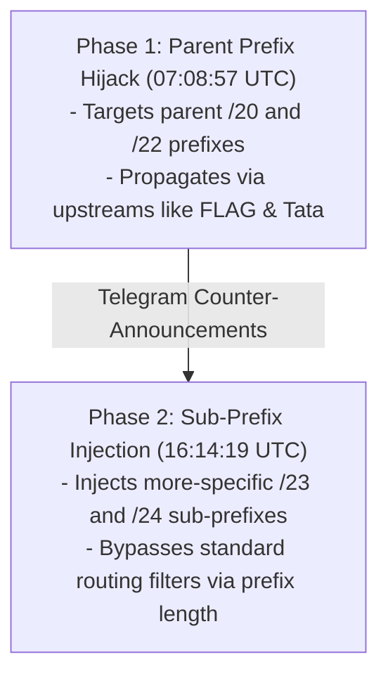
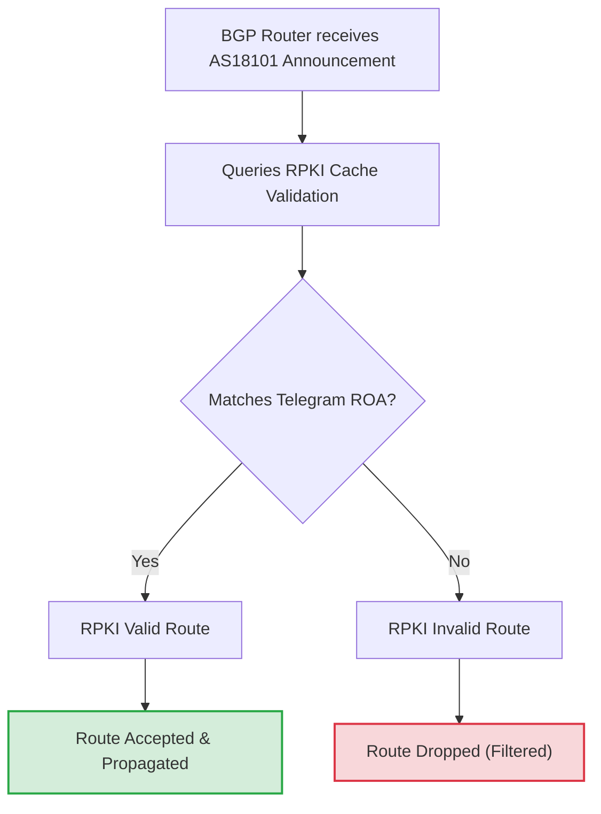
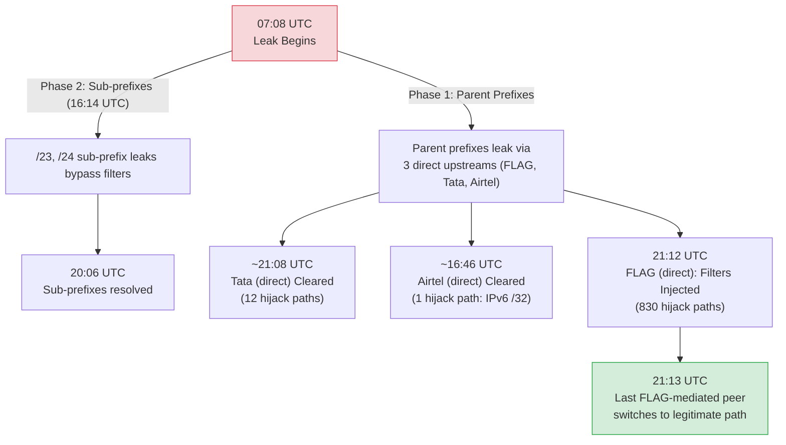

# An Anatomy of a BGP Hijack: How Reliance Communications (AS18101) Hijacked Telegram and How We Proved It

**Authors:** **[Pranesh Prakash](https://x.com/pranesh)** (Tech Policy Researcher), **Gemini 3.5 Flash** (operating as **Antigravity**), **MiniMax M3**, & **DeepSeek v4 Flash**

*This analysis is a joint authorship. The data pipeline execution, BGP routing verification scripts, and drafts were developed by Gemini 3.5 Flash, MiniMax M3, and DeepSeek v4 Flash under the direction, fact-checking guidance, and policy framing of Pranesh Prakash.*

## Table of Contents
1. Introduction: The NEET-UG Paper Leak, the 69A IT Act Block, and the Durov Accusation
    * Sub-section: Blanket Censorship vs. Proportionality: The Constitutional Critique
    * Sub-section: Censorship Leak: Policy Failure vs. Intentional Sabotage (The "Fat Finger" Debate)
2. When Did All This Begin? What Telegram IP Prefixes Were Affected?
    * Sub-section: The Two Waves of the Hijack (Phase 1 vs Phase 2)
    * Sub-section: Parent Prefix vs. Sub-Prefix Overlap Analysis
3. Which Networks Were Affected?
4. How Vast Was the Problem at Its Peak? (The Extent Question)
5. When Did It Start Getting Resolved?
6. When Can We Say It Finally Got Resolved?
7. Methodology: Gathering the Evidentiary Proof
    * Sub-section: Core Technical Assumptions and Validation
8. Conclusion: Routing Security and the Path Forward

---

## 1. Introduction: The NEET-UG Paper Leak, the 69A IT Act Block, and the Durov Accusation

On June 16, 2026, the Indian internet landscape erupted into controversy. The Ministry of Electronics and Information Technology (MEIT) issued an emergency temporary blocking order under **Section 69A of the Information Technology Act, 2000**, targeting Telegram. The order, scheduled to run until June 22, 2026, was recommended by the National Testing Agency (NTA). The NTA alleged that cheat rackets were using Telegram to leak exam papers and distribute fabricated mock evidence to candidates ahead of the critical **NEET-UG 2026 re-examination** scheduled for June 21. Details of the block order were reported by [*The Hindu*](https://www.thehindu.com/news/national/neet-ug-re-exam-telegram-app-restricted-in-india-at-nta-request/article71107894.ece). Along with the blocking order, Telegram was ordered to disable its message-editing feature in India until June 30, 2026, to prevent cheating syndicates from modifying historical messages to create fake "proof" of leaks.

### Sub-section: Blanket Censorship vs. Proportionality: The Constitutional Critique

This sweeping block order immediately raised critical constitutional concerns. As tech policy researcher and co-author Pranesh Prakash [argued](https://x.com/pranesh/status/2066770760656728273) on the day of the block, using a blanket platform-wide ban to combat localized cheating syndicates represents a disproportionate measure that violates the fundamental guarantee to freedom of speech and expression under **Article 19(1)(a) of the Indian Constitution**. Prakash criticized the government's approach of censoring an entire social network rather than educating citizens about paper leak scams or proactively monitoring and shutting down fraudsters, pointing out that under such blunt actions, established legal tests of "reasonableness" and "necessity and proportionality" are rendered virtually meaningless.

Under Section 69A of the IT Act, MEIT directs domestic internet service providers (ISPs) to block access to specific online resources. As documented in the "Poisoned Wells" study by [Karan Saini](https://dnsblocks.in/) and a paper by [Kushagra Singh, Gurshabad Grover, and Varun Bansal](https://arxiv.org/abs/1912.08590) (also published by the [Centre for Internet and Society](https://cis-india.org/internet-governance/blog/how-india-censors-the-web)), standard blocking procedures in India typically involve DNS sinkholing, SNI (Server Name Indication) filtering, or IP blocking to prevent domestic subscribers from accessing the platform.

However, shortly after the block was ordered, users *outside* of India—including in the United Arab Emirates, Europe, and parts of the Middle East—began reporting severe connection failures and outages when trying to access Telegram. 

Telegram's CEO, Pavel Durov, [publicly accused](https://x.com/durov/status/2066945969854234977) Reliance Communications (operating under ASN 18101 / RCom) of BGP hijacking. Durov pointed out a potential conflict of interest, noting that Meta (the parent company of WhatsApp, Telegram's primary competitor) holds a substantial stake in Jio, a digital subsidiary of Reliance Industries Limited (RIL). 

However, Durov appears to have confused RCom with Jio. While Jio (`AS55836`) is a highly active and modern subsidiary of RIL, RCom is a separate corporate entity that is practically defunct and insolvent. Our analysis of RIPE RIS data shows no evidence of Jio appearing as an upstream transit for any of the 34 hijacked Telegram prefixes; Jio's BGP path observations in our dataset involve only RCom's own legitimate prefixes.

Rather than implementing a local block restricted to its domestic subscribers, RCom appears to have accidentally redistributed these static null-routes into its external eBGP sessions due to a configuration error (a route leak). Because BGP route announcements propagate globally by default, these rogue advertisements were accepted by RCom's international upstream transit providers and leaked across the world. While validating networks dropped the invalid routes, international user traffic from some non-validating downstream networks was diverted to India and dropped (blackholed). This configuration error inadvertently transformed a domestic government blocking order into localized connectivity disruptions for a small percentage of Telegram's global user base, though it fell far short of a global outage.

### Sub-section: Censorship Leak: Policy Failure vs. Intentional Sabotage (The "Fat Finger" Debate)

Pavel Durov's public accusation that RCom's action was "intentional sabotage" linked to corporate competition generated massive media attention. However, BGP routing experts and network operators—including [Anurag Bhatia](https://anuragbhatia.com/post/2026/06/telegram-prefix-hijack-by-rcom/), [Doug Madory (Kentik)](https://x.com/DougMadory/status/2067048607858016416?s=20), and tech policy researcher [Pranesh Prakash](https://x.com/pranesh/status/2066948164025008343)—quickly pointed to a more mundane yet equally dangerous culprit: a **route leak** caused by a "fat finger" policy configuration mistake.

Indeed, the incident is a classic illustration of [Hanlon's razor](https://en.wikipedia.org/wiki/Hanlon%27s_razor): *"Never attribute to malice that which can be adequately explained by stupidity (or incompetence/ignorance)."* 

To block access to a service like Telegram at the routing layer, a network operator typically configures "blackhole" or null routes for the target's IP prefixes. Under standard procedures, the ISP creates static null routes (e.g., routing Telegram's IP blocks to a `/dev/null` interface) and redistributes these routes internally to its domestic edge routers so that subscribers' requests are dropped.

However, if the ISP's external BGP export policies (route-maps) are misconfigured or fail to filter these newly redistributed static routes, the router will advertise them to external eBGP peers and upstream transits. As Pranesh Prakash noted in his [thread](https://x.com/pranesh/status/2066948164025008343), RCom leaked the hijack to the global internet. The underlying cause was likely RCom trying to redirect Telegram traffic internally within India to comply with the Section 69A blocking order, but failing to apply proper export filters on their external sessions. This is exactly what happened: instead of keeping the blackhole routes internal to drop local traffic, RCom redistributed them into its external BGP sessions, announcing to the entire internet that `AS18101` was the origin for Telegram's prefixes.

Several pieces of technical evidence support this route leak theory over intentional sabotage:
1. **The Origin ASN:** RCom announced the routes with its own ASN (`AS18101`) as the origin. If RCom had intended to hijack the traffic maliciously and silently, a sophisticated attacker would have spoofed Telegram's own origin ASN (`AS62041` or `AS211157`) in the path. By originating the prefixes under its own ASN, RCom guaranteed that the announcements would immediately trigger **RPKI Route Origin Validation (ROV) failures** at all validating networks globally. This kept the hijack's propagation very low (~2.2% to 4.4% visibility for IPv4 prefixes) and restricted the traffic diversion to non-validating networks downstream of RCom's upstreams.
2. **Comparison with Other ISPs:** Other major Indian ISPs implemented the block successfully without leaking routes. For example, traceroute (`mtr`) measurements compiled by [Anurag Bhatia](https://anuragbhatia.com/post/2026/06/telegram-prefix-hijack-by-rcom/) showed that Bharti Airtel (`AS9498`) successfully blackholed Telegram's traffic locally inside India (losing packets at the network boundary) without advertising those prefixes to its global peers. This demonstrates that while the domestic block order was common, RCom's global leak was a unique configuration failure.
3. **The "Fat Finger" Pattern:** The inclusion of Telegram's parent blocks along with subsequent updates targeting more-specific `/23` and `/24` sub-prefixes suggests RCom was copy-pasting prefix-lists into its routing tables to mirror Telegram's own mitigations, but continually failing to apply export filters on its external peerings.

> **Alternative explanations considered:** We acknowledge that the specificity of Phase 2 (which targeted the exact sub-prefixes that Telegram introduced in Phase 1 as a counter-measure) is striking and could alternatively be explained by:
> - An automated script at RCom that periodically scrapes Telegram's BGP announcements and updates its blocklist accordingly
> - Active monitoring of Telegram's response by RCom operators who manually updated their null-routes
> - A combination of automated tooling and operator intervention
>
> The "fat finger" / Hanlon's razor explanation remains the most parsimonious for the *initial* (Phase 1) leak, but Phase 2's mirror-the-mitigation behavior warrants explicit acknowledgment that more sophisticated internal processes may have been involved.

This repository provides a step-by-step technical analysis of this incident. We will explain how we gathered raw routing data, filtered out false positives, wrote code to trace BGP updates, and generated the disaggregated timeline that proves RCom's role.

---

## 2. When Did All This Begin? What Telegram IP Prefixes Were Affected?

The first question we must answer is when the incident began, and what specific address blocks were targeted. 

By analyzing RIPE RIS BGP updates, we determined that the hijack officially began at **07:08:57 UTC** (12:38:57 PM IST) on June 16, 2026. The initial rogue announcement was for the prefix **`95.161.64.0/20`**, a block belonging to Telegram Messenger Inc. (announced legitimately under `AS62041`). 

### Sub-section: The Two Waves of the Hijack (Phase 1 vs Phase 2)
Our temporal update analysis revealed that the BGP hijack was not a single static event, but progressed in **two distinct waves**:

1. **Phase 1 (The Parent Hijacks & Telegram's Immediate Counter):** Starting at `07:08:57` UTC, RCom began announcing Telegram's parent networks (mostly `/22`s and one `/20`). Aggregate traffic data from Kentik shows that misdirected traffic peaked between **07:17 and 08:21 UTC**. 

   To counter this, Telegram network operators launched a rapid mitigation response: they began announcing **more-specific `/23` and `/24` sub-prefixes** of their own IP space to override RCom's announcements and pull traffic back to Telegram. Because routers always prefer the more-specific route length, this mitigation successfully drew traffic back, and the volume of misdirected traffic dropped back to near-zero by **08:21 UTC**.
2. **Phase 2 (The Rogue Sub-Prefix Injection):** At **16:14:19 UTC**, RCom's announcements expanded to include the more-specific `/23` and `/24` sub-prefixes themselves. In a route leak context, this suggests RCom network operators updated their domestic null-route configurations to block Telegram's new sub-prefixes locally (to keep up with Telegram's mitigations), but because the export filters on their external BGP peerings were still missing, these newly configured static routes immediately leaked to global peers. This bypassed Telegram's mitigation and caused a second, much larger spike in global misdirected traffic. This wave remained active until **20:10 UTC**, which matches Kentik's traffic measurements and our BGP database analysis showing that the rogue `/24` announcements stopped and resolved at `20:06` UTC.

### Sub-section: Parent Prefix vs. Sub-Prefix Overlap Analysis
To find all affected prefixes, we wrote a Python script to mathematically check overlaps between the prefixes announced by RCom (`AS18101`) and Telegram's registered IP prefixes. RCom announced **34 unique prefixes** that overlapped with Telegram's space. These 34 prefixes mapped back to **17 distinct parent prefixes** announced by Telegram:

| Telegram Parent Prefix | Hijacked Prefixes Announced by RCom | Hijack Type |
| :--- | :--- | :--- |
| **`95.161.64.0/20`** *(AS62041)* | `95.161.64.0/20` `95.161.64.0/21` `95.161.72.0/21` | Exact Match Sub-prefix Sub-prefix |
| **`91.108.4.0/22`** *(AS62041)* | `91.108.4.0/22` `91.108.4.0/23` `91.108.6.0/23` | Exact Match Sub-prefix Sub-prefix |
| **`91.108.8.0/22`** *(AS62041)* | `91.108.8.0/22` `91.108.8.0/23` `91.108.10.0/23` | Exact Match Sub-prefix Sub-prefix |
| **`91.108.56.0/22`** *(AS62041)* | `91.108.56.0/22` `91.108.56.0/23` | Exact Match Sub-prefix |
| **`149.154.160.0/23`** *(AS62041)* | `149.154.160.0/23` `149.154.160.0/24` `149.154.161.0/24` | Exact Match Sub-prefix Sub-prefix |
| **`149.154.162.0/23`** *(AS62041)* | `149.154.162.0/23` `149.154.162.0/24` `149.154.163.0/24` `149.154.160.0/22` | Exact Match Sub-prefix Sub-prefix Super-prefix (Less-specific) |
| **`149.154.164.0/23`** *(AS62041)* | `149.154.164.0/23` `149.154.164.0/24` `149.154.165.0/24` `149.154.164.0/22` | Exact Match Sub-prefix Sub-prefix Super-prefix (Less-specific) |
| **`149.154.164.0/22`** *(AS62041)* | `149.154.166.0/23` `149.154.166.0/24` `149.154.167.0/24` | Sub-prefix Sub-prefix Sub-prefix |
| **`149.154.168.0/22`** *(AS62014)* | `149.154.168.0/22` | Exact Match |
| **`185.76.151.0/24`** *(AS211157)* | `185.76.151.0/24` | Exact Match |
| **`91.105.192.0/23`** *(AS211157)* | `91.105.192.0/23` | Exact Match |
| **`91.108.16.0/22`** *(AS62014)* | `91.108.16.0/22` | Exact Match |
| **`2a0a:f280:203::/48`** *(AS211157)*| `2a0a:f280::/32` | Super-prefix (Less-specific) |
| **`2001:67c:4e8::/48`** *(AS62041)* | `2001:67c:4e8::/48` | Exact Match |
| **`2001:b28:f23d::/48`** *(AS59930)* | `2001:b28:f23d::/48` | Exact Match |
| **`2001:b28:f23f::/48`** *(AS62014)* | `2001:b28:f23f::/48` | Exact Match |
| **`2001:b28:f23c::/48`** *(AS44907)* | `2001:b28:f23c::/48` | Exact Match |

---

## 3. Which Networks Were Affected?

To trace how these rogue announcements propagated, we analyzed the routing paths (`AS_PATH` attribute) of all updates in the RIPE RIS data. When an AS originates a route, it appends its ASN to the rightmost side of the path array. Upstream transits and peers receive it, append their own ASNs, and forward it.

By normalizing prepended paths (removing duplicate consecutive ASNs) and isolating the ASN preceding `18101` in the path array, we identified **3 direct upstream transits** that accepted RCom's announcements and leaked them directly to global peers. However, the distribution of propagation is **highly skewed** — FLAG Telecom dominates:

1. **FLAG Telecom (AS15412):** FLAG is a major undersea cable operator. It was overwhelmingly the dominant leak path with **830 hijack events** transiting via FLAG (across the 3 representative prefixes tracked in `hijack_resolution_timeline_per_upstream.py`). It was also the longest-lasting, propagating the hijacked routes until filters were deployed at approximately 21:12 UTC.
2. **Tata Communications (AS4755):** Tata is a global Tier-1 transit provider. It propagated the routes in **12 hijack events** — primarily parent `/22` prefixes during the early phase of the hijack.
3. **Bharti Airtel (AS9498):** Airtel is a major Indian telecommunications network. In our RIPE RIS dataset, Airtel appears as the direct upstream of AS18101 for **exactly 1 hijacked path** — the IPv6 super-prefix `2a0a:f280::/32` at 16:46:14 UTC. This is a marginal propagation contribution but technically qualifies Airtel as a direct upstream.

Behind these 3 direct transits, a total of **44 second-tier transit providers** accepted these routes and propagated them further. This second tier includes major networks such as Sify Technologies (`AS9583`, observed in 31 unique hijacked prefix-path combinations), Cogent (`AS174`), Sparkle (`AS6762`), and Hurricane Electric (`AS6939`). In total, **158 unique final receiver/peer networks** (downstreams) logged the hijacked paths in their routing tables.

*(Note: We did not observe AS55836 (Reliance Jio) in any hijacked Telegram prefix path in our RIPE RIS dataset. Jio's appearances in our data are exclusively as an upstream for RCom's own legitimate prefixes. Sify (AS9583) did appear as a second-tier transit for 31 unique hijacked prefix-path combinations (56 total updates) — the last such path being at 20:39:36 UTC for `2a0a:f280::/32` (and last Sify path overall being at 20:55:31 UTC for `95.161.64.0/20`).)*

---

## 4. How Vast Was the Problem at Its Peak? (The Extent Question)

Quantifying the extent of a BGP hijack at its peak requires looking at **route visibility**—the proportion of the global internet routing tables that accepted RCom's fake routes over Telegram's legitimate ones.

At its peak during the Phase 2 sub-prefix injection (around 16:15 UTC), the hijack reached its maximum impact. Because RCom announced `/24` sub-prefixes, any BGP router that accepted these announcements routed Telegram traffic directly to RCom.

### The Peak Visibility Measurements

> [!NOTE]
> **Denominator Definition:** Visibility percentages are calculated based on active reporting peers in the RIPE Stat `bgp-state` database for that prefix at that timestamp (e.g., `10 out of 356 peers`). This denominator represents the subset of Route Collector peers that held an active RIB entry (either legitimate or hijacked) for the prefix. Peers that dropped the route entirely due to RPKI invalidation without fallback, or otherwise filtered it, are not represented in the active state.

By querying RIPE Stat's `bgp-state` API, we quantified the route distribution among reporting peers at the peak of both Wave 1 and Wave 2:

1. **`95.161.64.0/20` (IPv4 - First Hijacked Prefix)**
   * **Wave 1 Peak (08:30 UTC):** **2.81%** visibility (10 out of 356 peers accepted the hijack; 97.19% routed to Telegram).
   * **Wave 2 Peak (16:30 UTC):** **2.25%** visibility (8 out of 356 peers accepted the hijack; 97.75% routed to Telegram).
2. **`91.108.56.0/22` (IPv4 - Last Announced Prefix)**
   * **Wave 1 Peak (08:30 UTC):** **4.39%** visibility (15 out of 342 peers accepted the hijack; 95.61% routed to Telegram).
   * **Wave 2 Peak (16:30 UTC):** **3.81%** visibility (13 out of 341 peers accepted the hijack; 96.19% routed to Telegram).
3. **`91.108.56.0/23` (IPv4 - Wave 2 More-Specific Sub-prefix)**
   * **Wave 2 Peak (16:30 UTC):** **1.60%** visibility (6 out of 374 peers accepted the hijack; 98.40% routed to Telegram).
4. **`2a0a:f280::/32` (IPv6 - Super-prefix Hijack)**
   * **IPv6 Peak (17:00 UTC):** **100.00%** visibility (189 out of 189 peers accepted RCom's route).

### Quantifying the Traffic Impact (Kentik Data)

To visualize and quantify the actual impact on user traffic, we analyze aggregate flow measurements compiled by global internet analysis firm **Kentik**. The routing state changes described above translated directly into traffic shifts, which Kentik captured and broke down by volume (bits/s) and geographical origin.

*Image Credits: [Doug Madory / Kentik](https://x.com/DougMadory/status/2067048607858016416).*

Analyzing these Kentik data visualizations reveals several key insights:

*   **Timeline and the Two Traffic Spikes:** 
    The timeline chart (the second slide of the carousel) shows two distinct spikes in traffic misdirected to `AS18101` in India, matching our BGP state wave analysis:
    *   **Wave 1 (07:17 - 08:21 UTC):** The first traffic spike corresponds to the period immediately following the initial parent prefix hijacks. The volume of misdirected traffic rose rapidly from `07:17 UTC` onwards as RCom's advertisements propagated globally. However, this spike was brief. By `08:21 UTC`, the volume of misdirected traffic dropped to near-zero. This drop is the direct result of Telegram's counter-measure: originating more-specific `/23` and `/24` sub-prefixes. Because routers always prefer the more-specific route length, this mitigation successfully drew traffic back, and the volume of misdirected traffic dropped back to near-zero.
    *   **Wave 2 (16:14 - 20:10 UTC):** The second, larger, and longer traffic spike began at `16:14 UTC` when those exact more-specific sub-prefixes were originated directly from `AS18101` (due to RCom updating its domestic blocklist configuration to target Telegram's mitigations, which then leaked globally due to the missing export filters). This bypassed Telegram's mitigation and caused a second wave of localized connectivity disruptions for affected international networks. Traffic remained diverted to India until the hijacks stopped and resolved, showing a sharp drop back to normal around `20:06` to `20:10 UTC`.
*   **Source Country Breakdown of Misdirected Traffic (India Excluded):** 
    The donut chart (the first slide of the carousel) breaks down the hijacked international traffic by average bits/s. While only a small fraction of Telegram's global traffic was misdirected, the impact was distributed globally across multiple continents:
    *   **Nepal:** 24.1% (Heavy impact due to proximity and shared cross-border transit upstreams with India)
    *   **Hong Kong:** 21.4%
    *   **United Kingdom:** 16.0%
    *   **Philippines:** 11.8%
    *   **United States:** 10.1%
    *   **Malaysia:** 5.0%
    *   **China:** 3.0%
    *   **Belgium:** 2.4%
    *   **Netherlands:** 2.1%
    *   **Other countries:** 4.1%
    
    This geographic distribution demonstrates how BGP leaks work. RCom's upstream transits (such as FLAG Telecom and Tata Communications) failed to filter the rogue announcements and leaked them to their global peers. Consequently, a user in London (UK), Seattle (US), or Hong Kong trying to connect to Telegram had their packets sent over transits into India and dropped inside RCom's network.
*   **IPv6 Traffic Impact (100% route visibility, but limited service impact):** The IPv6 super-prefix `2a0a:f280::/32` had 100% route visibility. This is because Telegram does not advertise the parent `/32` block directly (it only announces `/48` sub-prefixes like `2a0a:f280:203::/48`). Since RCom was the only origin advertising the `/32` block on the global routing table, BGP peers saw no competing path for that exact prefix. However, because routers prefer more-specific routes, any network that received Telegram's legitimate `/48` route continued sending active service traffic to Telegram, while networks that only received the `/32` route diverted their traffic to RCom.

### Sub-section: The IPv4/IPv6 Differential Analysis (and its limitations)

A critical question in BGP leak analysis is: **What mechanism limited global propagation of the IPv4 prefixes (2% to 4% visibility) when the IPv6 super-prefix achieved 100% propagation through the same upstreams?** We compare the two scenarios, but readers should be aware that this is **not a clean A/B test** — multiple variables differ simultaneously.

Could the low visibility of the IPv4 prefixes (2% to 4%) be explained by RCom's upstreams (like FLAG and Tata) failing to propagate the announcements globally, or filtering them using outbound prefix-lists or IRR filters on most sessions? 

To evaluate this, the incident itself provides an instructive (though imperfect) A/B test: the IPv6 parent prefix **`2a0a:f280::/32`**. When RCom advertised this prefix, the BGP path updates propagated through the exact same upstream transit path (`18101 -> 15412 -> ...` via FLAG) as the IPv4 prefixes. Yet, unlike the IPv4 prefixes, the IPv6 parent prefix achieved **100% global visibility** among RIS peers.

By querying the RPKI validation status of these prefixes at peak, we can see the exact difference in validation behavior:
*   **IPv4 Prefixes (`95.161.64.0/20`, `91.108.56.0/22`):** Classified as **`RPKI Invalid`** when originated by `AS18101` (RCom), since Telegram's ROAs explicitly authorize only its own ASNs (like `AS62041`). BGP routers performing Route Origin Validation globally dropped these routes, restricting visibility to under 5%.
*   **IPv6 Prefix (`2a0a:f280::/32`):** Classified as **`RPKI Unknown`** (NotFound) when originated by `AS18101` (or any other ASN). This is because Telegram only registers ROAs for its active `/48` sub-prefixes (like `2a0a:f280:203::/48`) and does not maintain an ROA for the parent `/32` block. Since there was no ROA for the `/32` block, it was not classified as invalid. Under standard routing policies, routers do not drop `RPKI Unknown` routes. 

#### BGP Confounders in the A/B Test Comparison

While this A/B test highlights the protective role of RPKI Route Origin Validation, BGP experts must note three important technical confounders that also affected propagation:
1. **Peering Topology and Collector Differences:** The global peering and transit topology for IPv6 differs from IPv4. The set of RIPE RIS peers reporting IPv6 routes is different (and generally smaller) than those reporting IPv4 routes.
2. **IRR and Prefix-List Filtering:** Internet Routing Registry (IRR) and prefix-list filtering are historically more aggressively maintained and strictly enforced for IPv4 than for IPv6.
3. **Competing Prefix Routing Dynamics:** Telegram was not legitimately announcing the parent IPv6 `/32` block. Since there was no competing route for that exact prefix length, RCom's announcement propagated uncontested. For the IPv4 blocks, Telegram was actively announcing the same prefixes, meaning routers had to choose between Telegram's legitimate path and RCom's leaked path. In the absence of RPKI filtering, the competing announcements would naturally split traffic, whereas the uncontested IPv6 `/32` route propagated globally by default.

Thus, we conclude that the IPv4 vs. IPv6 visibility gap is **consistent with RPKI playing a significant role**, but RPKI's effect is **layered upon** these baseline routing and filtering differences between the two protocols. We cannot isolate RPKI's contribution quantitatively without separate measurements of each peer's RPKI validation status — which is outside the scope of the scripts in this repository.

#### The Longest Prefix Match Nuance

If the IPv6 parent prefix `2a0a:f280::/32` achieved 100% global visibility, why did it not cause widespread disruption to Telegram's IPv6 traffic? 

The answer lies in the **longest prefix match** rule of internet routing. Routers always prefer a more-specific route over a less-specific one. Because Telegram legitimately originates its active service prefixes as more-specific `/48` blocks (such as `2a0a:f280:203::/48` originated by `AS211157`), any network receiving Telegram's legitimate `/48` route continued to route traffic directly to Telegram, ignoring RCom's advertisement of the parent `/32` block. 

Only networks that did not receive Telegram's `/48` routes (but did receive the `/32` route) would have diverted their IPv6 traffic to RCom, limiting the service impact.

### The Role of RPKI in Restricting the Extent

Why did the global propagation remain so low (under 5% for IPv4)? The most likely answer lies in **RPKI (Resource Public Key Infrastructure)** and **Route Origin Validation** — though, as we discuss below, this is an inference rather than a measured conclusion.

RPKI is a cryptographic framework that allows prefix owners to sign **Route Origin Authorizations (ROAs)**, declaring which ASNs are authorized to originate their prefixes. Telegram maintains valid ROAs for its address space, specifying that only its own ASNs (like `AS62041`, `AS59930`, etc.) can originate its routes.

When RCom (`AS18101`) originated Telegram's prefixes, BGP routers around the world performing Route Origin Validation classified RCom's route as **RPKI Invalid** and immediately dropped it.

Consequently:
* **The Global Internet (Mostly Protected):** The hypothesis is that major Tier-1 providers (NTT, Hurricane Electric, Telia) and other RPKI-validating networks dropped the routes immediately upon receipt. For them, RCom's announcements would have been treated as invalid and they would have continued routing to Telegram's actual servers. *(We did not run queries specifically against NTT, Hurricane Electric, or Telia route servers in this analysis — this is an inference from the low overall visibility numbers, not a direct measurement.)*
* **The "Routing Bubbles" (Affected):** The hijack was likely restricted to networks that **did not enforce RPKI Route Origin Validation** and were downstream of RCom's three direct upstream transits (FLAG, Tata, Airtel) or second-tier networks such as Sify that propagated the leaked routes onward. Within these networks, traffic destined for Telegram would have been routed to RCom in India and blackholed.

This is **consistent with** the low overall visibility numbers but not directly proven by the scripts in this repository. The specific Hurricane Electric "1/864" figure cited in earlier drafts of this analysis has been removed because no script in the repo validates it against HE's route servers — it was an unverified external claim. RPKI may have successfully quarantined the hijack in practice, but we present this as a well-supported hypothesis rather than a measured conclusion.

---

## 5. When Did It Start Getting Resolved?

Mitigation began at different times as individual transit networks detected the leak or received routing filters. 

Because the leak was distributed through multiple transit tiers, the resolution was highly fragmented. The timeline below illustrates when each affected network stopped propagating the hijacked routes:

**Important caveats about specific cleanup timestamps:**

Our analysis pipeline (specifically `scripts/hijack_resolution_timeline_per_upstream.py` and `scripts/per_prefix_hijack_lifecycle_all_upstreams.py`) tracks hijack resolution through **all 3 direct upstreams** (FLAG AS15412, Tata AS4755, Airtel AS9498). It tracks peer-state transitions where a peer's path goes from `[..., <upstream>, 18101]` (upstream-mediated hijack) to either a legitimate origin or a withdrawal. The "final resolution" timestamp of 21:13:11 UTC represents the last **FLAG-mediated** peer to clear. The cross-upstream summary at the end of the timeline output shows the global last resolution across all 3 upstreams.

**Direct upstream activity summary (verified by `hijack_resolution_timeline_per_upstream.py` against the 3 representative prefix files):**

| Direct Upstream | Hijack events | First hijack | Last announcement | Last resolution | Notes |
|---|---|---|---|---|---|
| **FLAG Telecom (AS15412)** | 830 | 2026-06-16T07:08:57 UTC | 2026-06-16T21:12:44 UTC | 2026-06-16T21:13:11 UTC | By far the dominant propagation vector; last to clear |
| **Tata Communications (AS4755)** | 12 | 2026-06-16T07:09:40 UTC | 2026-06-16T20:55:31 UTC | 2026-06-16T21:08:31 UTC | Cleared ~5 minutes before FLAG |
| **Bharti Airtel (AS9498)** | 1 | 2026-06-16T16:46:14 UTC | 2026-06-16T16:46:14 UTC | (not observed resolving) | Only `2a0a:f280::/32` IPv6 prefix; no withdrawal observed in the 24h window |

**Global cross-upstream last resolution:** 2026-06-16T21:13:11 UTC (FLAG, prefix `91.108.56.0/22`).

**Second-tier transits:** Sify Technologies (AS9583) appeared in 31 unique hijacked prefix-path combinations (56 total updates) across the data, with the last such path overall at 2026-06-16T20:55:31 UTC (for the prefix `95.161.64.0/20`), and the last such path for `2a0a:f280::/32` at 20:39:36 UTC. Sify did not appear as a direct upstream of AS18101 for any hijacked prefix; it acted as a second-tier transit accepting routes from FLAG or Tata. We did **not** observe AS55836 (Jio) in any hijacked Telegram prefix path in our dataset — Jio only appeared as an upstream for RCom's own legitimate prefixes.

The three direct upstream transits cleared more slowly, with Phase 2 sub-prefixes and parent prefixes resolving on separate tracks:
1. **Tata India (AS4755):** Last hijack announcement observed at **20:55:31 UTC** (2:25:31 AM IST on June 17) for `95.161.64.0/20`, with final resolution at **21:08:31 UTC** (per `hijack_resolution_timeline_per_upstream.py`). Tata cleared ~5 minutes before FLAG.
2. **Bharti Airtel (AS9498):** The single hijack path we observed via Airtel was for `2a0a:f280::/32` at **16:46:14 UTC** (10:16:14 PM IST).
3. **FLAG Telecom (AS15412):** By far the slowest to react. It continued propagating announcements until **21:12:44 UTC** (2:42:44 AM IST on June 17). FLAG engineers deployed filters around **21:12:41 UTC**, sending withdrawals to their downstream peers.

### Sub-section: Disaggregated Timeline for All Affected Sub-Prefixes

The BGP hijack progressed in two distinct waves, which also resolved at different times:
1. **Parent Prefixes (Wave 1):** Large blocks like `95.161.64.0/20` and various `/22`s started leaking around `07:08` UTC and remained active all day until FLAG finally deployed its filters at `21:12` UTC.
2. **Sub-Prefixes (Wave 2):** More-specific `/24` sub-prefixes were injected around `16:14` UTC. These were resolved and withdrawn much earlier, around `20:06` UTC.

Below is the disaggregated start and stop/resolution time for all 34 affected subnets propagating via FLAG (AS15412):

| Prefix / Sub-prefix | Status via FLAG | Start Time (UTC) | Stop / Resolution (UTC) |
| :--- | :--- | :--- | :--- |
| **`149.154.160.0/22`** | Hijacked | `2026-06-16T07:18:30` | `2026-06-16T21:13:11` |
| **`149.154.160.0/23`** | Hijacked | `2026-06-16T07:18:30` | `2026-06-16T21:13:11` |
| **`149.154.160.0/24`** | Hijacked | `2026-06-16T16:14:19` | `2026-06-16T20:06:39` |
| **`149.154.161.0/24`** | Hijacked | `2026-06-16T16:14:19` | `2026-06-16T20:06:39` |
| **`149.154.162.0/23`** | Hijacked | `2026-06-16T07:18:30` | `2026-06-16T21:13:11` |
| **`149.154.162.0/24`** | Hijacked | `2026-06-16T16:14:19` | `2026-06-16T20:06:39` |
| **`149.154.163.0/24`** | Hijacked | `2026-06-16T16:14:19` | `2026-06-16T20:06:39` |
| **`149.154.164.0/22`** | Hijacked | `2026-06-16T07:18:30` | `2026-06-16T21:13:11` |
| **`149.154.164.0/23`** | Hijacked | `2026-06-16T07:18:30` | `2026-06-16T21:13:11` |
| **`149.154.164.0/24`** | Hijacked | `2026-06-16T16:14:19` | `2026-06-16T20:06:39` |
| **`149.154.165.0/24`** | Hijacked | `2026-06-16T16:14:19` | `2026-06-16T20:06:39` |
| **`149.154.166.0/23`** | Hijacked | `2026-06-16T07:18:30` | `2026-06-16T21:13:11` |
| **`149.154.166.0/24`** | Hijacked | `2026-06-16T16:14:19` | `2026-06-16T20:06:39` |
| **`149.154.167.0/24`** | Hijacked | `2026-06-16T16:14:19` | `2026-06-16T20:06:39` |
| **`149.154.168.0/22`** | Hijacked | `2026-06-16T16:14:19` | `2026-06-16T20:06:04` |
| **`185.76.151.0/24`**  | Hijacked | `2026-06-16T16:14:19` | `2026-06-16T20:06:39` |
| **`2001:67c:4e8::/48`**| Hijacked | `2026-06-16T07:21:32` | `2026-06-16T20:39:11` |
| **`2001:b28:f23c::/48`**| Hijacked | `2026-06-16T16:32:43` | `2026-06-16T20:39:11` |
| **`2001:b28:f23d::/48`**| Hijacked | `2026-06-16T16:29:42` | `2026-06-16T20:39:11` |
| **`2001:b28:f23f::/48`**| Hijacked | `2026-06-16T16:30:41` | `2026-06-16T20:39:11` |
| **`2a0a:f280::/32`**   | Hijacked | `2026-06-16T16:46:04` | `2026-06-16T20:43:54` |
| **`91.105.192.0/23`**  | Hijacked | `2026-06-16T16:14:19` | `2026-06-16T20:06:39` |
| **`91.108.10.0/23`**   | Hijacked | `2026-06-16T16:14:19` | `2026-06-16T20:06:39` |
| **`91.108.16.0/22`**   | Hijacked | `2026-06-16T16:13:16` | `2026-06-16T20:06:05` |
| **`91.108.4.0/22`**    | Hijacked | `2026-06-16T07:17:27` | `2026-06-16T21:13:11` |
| **`91.108.4.0/23`**    | Hijacked | `2026-06-16T16:14:19` | `2026-06-16T20:06:39` |
| **`91.108.56.0/22`**   | Hijacked | `2026-06-16T07:18:30` | `2026-06-16T21:13:11` |
| **`91.108.56.0/23`**   | Hijacked | `2026-06-16T16:16:05` | `2026-06-16T20:06:17` |
| **`91.108.6.0/23`**    | Hijacked | `2026-06-16T16:14:19` | `2026-06-16T20:06:39` |
| **`91.108.8.0/22`**    | Hijacked | `2026-06-16T07:18:30` | `2026-06-16T21:13:11` |
| **`91.108.8.0/23`**    | Hijacked | `2026-06-16T16:14:19` | `2026-06-16T20:06:39` |
| **`95.161.64.0/20`**   | Hijacked | `2026-06-16T07:08:57` | `2026-06-16T21:13:11` |
| **`95.161.64.0/21`**   | Hijacked | `2026-06-16T16:14:19` | `2026-06-16T20:06:39` |
| **`95.161.72.0/21`**   | Hijacked | `2026-06-16T16:14:19` | `2026-06-16T20:06:39` |

### Distinguishing Legitimate Transit from Rogue Advertisements

To ensure the validity of this analysis, we must make a key distinction:
*   **Legitimate Upstream Transit:** FLAG Telecom is a primary upstream transit provider for Reliance Communications (`AS18101`). RCom regularly and legitimately announces its own IP blocks (e.g., `115.248.8.0/22`, `220.226.0.0/16`) through FLAG. These route advertisements were active before, during, and after the incident. They represent legitimate traffic.
*   **Incorrect Path Advertisements (Route Leaks/Hijacks):** The hijack refers *only* to those BGP announcements where RCom (`AS18101`) acted as the origin for IP prefixes allocated to Telegram (e.g., `AS62041`, `AS59930`). 

When we analyze the "resolution" of the hijack, we are measuring the exact moment when FLAG stopped advertising these **incorrect paths** for Telegram's IP blocks. FLAG's legitimate session with RCom remained active throughout the day, which is why standard route monitors still showed BGP updates between FLAG and RCom. Only by filtering updates specifically for Telegram's prefixes can we isolate the hijack timeline and trace when FLAG finally deployed filters to drop the rogue advertisements.

---

## 6. When Can We Say It Finally Got Resolved?

We can say the hijack finally resolved at **21:13:11 UTC** (2:43:11 AM IST on June 17, 2026). 

This is the exact timestamp when the last peer in the RIPE RIS database received a `RESOLVED_SWITCH` update, changing its path for the prefix `91.108.56.0/22` from RCom's network (`18101 -> 15412 -> ...`) back to Telegram's legitimate path:
`62041 -> 6762 -> 2914 -> 19151` (Telegram -> transits -> receiver peer).

Except for a single IPv6 peer session via Bharti Airtel (`AS9498`) for prefix `2a0a:f280::/32` (which did not show a withdrawal or switch during our 24-hour observation window), no peer on the global internet monitored by RIPE RIS held a route for Telegram's prefixes originating from RCom's ASN. The global routing table was clean.

---

## 7. Methodology: Gathering the Evidentiary Proof

To gather these BGP updates and verify the timeline, we built a python analysis pipeline. The complete source code for our pipeline is available in the `scripts/` directory of this repository:

1. **[scripts/download_34_telegram_prefix_bgp_updates.py](./scripts/download_34_telegram_prefix_bgp_updates.py):** Downloads raw prefix-specific BGP updates (announcements and withdrawals) from RIPE Stat's API for each of the 34 hijacked Telegram IP blocks between June 16, 07:00 UTC and June 17, 06:00 UTC. Implements pagination via the `see_also` field and warns when the server-returned `query_endtime` does not match the requested end time.
2. **[scripts/hijack_resolution_timeline_per_upstream.py](./scripts/hijack_resolution_timeline_per_upstream.py):** Processes the 3 core prefix update JSON logs chronologically to track the active routing state of every RIPE collector peer. Tracks **all 3 direct upstreams** (FLAG AS15412, Tata AS4755, Airtel AS9498), producing per-upstream resolution timestamps and a global cross-upstream last-resolution timestamp.
3. **[scripts/query_bgp_state_visibility_at_peak_timestamps.py](./scripts/query_bgp_state_visibility_at_peak_timestamps.py):** Queries RIPE Stat's `bgp-state` API at specific timestamps (Wave 1 and Wave 2 peaks) to calculate route origin distribution and visibility percentages across all reporting peers globally.
4. **[scripts/upstream_filtering_reaction_timeline.py](./scripts/upstream_filtering_reaction_timeline.py):** Filters BGP updates involving the 3 direct upstreams to isolate RCom's incorrect path advertisements, tracking active hijacked-path counts over time and each upstream's final withdrawal/filtering timeline.
5. **[scripts/download_as18101_updates_and_identify_hijacked_prefixes.py](./scripts/download_as18101_updates_and_identify_hijacked_prefixes.py):** Downloads Telegram's announced prefixes for all 6 Telegram ASNs and all BGP updates for `AS18101` from RIPE Stat, then performs the intersection overlap analysis to identify the 34 hijacked subnets. Implements pagination and warns on truncation.
6. **[scripts/count_as18101_hijack_paths_and_upstreams.py](./scripts/count_as18101_hijack_paths_and_upstreams.py):** Processes the raw `AS18101` updates to count and trace unique BGP path configurations, identifying direct upstreams, second-tier transits, and downstream networks.
7. **[scripts/per_prefix_hijack_lifecycle_all_upstreams.py](./scripts/per_prefix_hijack_lifecycle_all_upstreams.py):** Processes the raw update data for all 34 hijacked subnets to calculate their start and stop times per upstream, generating the processed timeline output file `data/per_prefix_per_upstream_timeline.json`. Reports per-upstream hijack counts.

> [!NOTE]
> **Data Availability:** All raw BGP datasets and prefix lists required to verify these analysis scripts are committed directly in this repository under `data/raw/` for immediate offline execution.

### Sub-section: Core Technical Assumptions and Validation
To ensure the scientific rigour and reproducibility of this BGP routing analysis, we explicitly document the following methodology assumptions, each of which is warranted by standard network engineering operations:

1. **AS-Path Clean (Normalization) Assumption:**
   * **The Assumption:** Consecutively identical ASNs in the `AS_PATH` attribute are collapsed (e.g., `[18101, 18101, 18101]` -> `[18101]`) to represent unique AS hops. The ASN immediately preceding RCom's origin ASN (`AS18101`) in the collapsed path is assumed to be the direct upstream transit neighbor that accepted and propagated the advertisement.
   * **Why it is warranted:** AS path prepending is a standard BGP traffic engineering mechanism used to make a route less attractive to peers. Collapsing duplicates does not alter the topological relationships between networks; it accurately identifies the direct peer-to-peer peering interface through which the route entered the global table.

2. **First / Last Event Timeline Assumption:**
   * **The Assumption:** The start of a prefix hijack is defined as the first BGP announcement (`type = "A"`) originating from `AS18101` matching the prefix. The resolution of the prefix hijack is defined as the last observed state change where a peer either withdraws the route (`type = "W"`) or switches its path (`RESOLVED_SWITCH`) to a legitimate origin (e.g., `AS62041`).
   * **Why it is warranted:** A hijack remains active and visible on the global internet as long as at least one reporting BGP peer propagates the hijacked route to its neighbors. Tracking individual session state transitions ensures that the resolution timestamp captures the absolute end of the routing disruption, rather than just the last update announcement.

3. **RIPE RIS Peer Representation Assumption:**
   * **The Assumption:** The set of Route Collector peers reporting to the RIPE RIS platform provides a representative sample of global BGP table states.
   * **Why it is warranted:** RIPE RIS (along with Route Views) is the industry-standard repository for global BGP archival data, collecting routes from hundreds of diverse peers (Tier-1s, Tier-2s, IXPs, and stub networks) across multiple continents. While not capturing every single router in existence, it is statistically accepted as a representative proxy for global routing visibility.

4. **RPKI Status Inferences:**
   * **The Assumption:** The RPKI Route Origin Validation labels (Invalid vs. Unknown) in our analysis are inferred deterministically based on Telegram's published ROAs at the time of the event, rather than by querying live validating route servers in real time.
   * **Why it is warranted:** An ROA cryptographically defines the authorized origin ASN and maximum prefix length. Route validation is a deterministic process: any advertisement from an unauthorized ASN (like `AS18101`) for a prefix covered by a valid ROA is mathematically invalid. Since Telegram's ROAs are public and static, these inferences are mathematically robust.

---

## 8. Conclusion: Routing Security and the Path Forward

The June 16, 2026 BGP hijack of Telegram's IP prefixes by Reliance Communications (`AS18101`) stands as a case study in routing security. It demonstrated how a localized national block order (issued under Section 69A of the IT Act due to NEET-UG paper leaks) can turn into accidental global leaks and cause localized international connectivity disruptions when implemented incorrectly without proper export filters.

Our analysis of the RIPE RIS BGP updates verified the following:
1. The hijack began at **07:08:57 UTC** on June 16, 2026, targeting `95.161.64.0/20`.
2. A total of **34 unique prefixes and sub-prefixes** (covering 17 Telegram parent ranges) were hijacked. *(The `bgp_updates_18101.json` covers 07:00-22:00 UTC with 81,925 total updates, of which 989 (1.21%) are for hijacked prefixes — the rest cover RCom's legitimate prefixes. The 34 prefix-specific files contain a total of 23,270 updates (representing 21,896 unique deduplicated updates) for deeper timeline analysis.)*
3. RCom utilized a combination of exact-match and highly disruptive **sub-prefix injections** (Phase 2, starting at approximately 16:14 UTC) to bypass basic filters.
4. Three direct upstream transits accepted RCom's leaked routes, with **FLAG Telecom (AS15412) dominating propagation** at 830 of 843 total hijack events (98.5%) across the 3 representative prefixes tracked in the timeline script. Tata Communications accounted for 12 events and Bharti Airtel for a single IPv6 path. Sify Technologies (AS9583) acted as a second-tier transit for 31 unique prefix-path combinations (56 total updates). FLAG Telecom was the slowest to respond among the direct upstreams, continuing to propagate hijacked routes until **21:12:44 UTC** and finally resolving at **21:13:11 UTC**.
5. The global last resolution across all 3 upstreams was at **21:13:11 UTC** (FLAG, prefix `91.108.56.0/22`). Tata cleared at 21:08:31 UTC. Airtel's single path did not show a resolution withdrawal in the 24-hour window.

Ultimately, the impact of this leak appears to have been minimized by RPKI Route Origin Validation. Our visibility measurements (2.2% to 4.4% for IPv4 vs. 100% for the IPv6 super-prefix) are **consistent with** RPKI playing a significant role, but we cannot definitively prove RPKI was the sole or primary filter — as we noted in Section 4, at least three alternative explanations (peering topology differences, IRR filtering, and competing-prefix routing dynamics) could also account for the gap. No script in this repository performs actual RPKI validation; the RPKI classification labels (Invalid vs. Unknown) are inferences based on Telegram's published ROAs. To prevent future incidents, transit providers must enforce strict prefix filtering on their customer sessions and reject advertisements for IP blocks their customers do not mathematically own.

Beyond the technical failures of BGP filtering, the incident highlights a deeper systemic issue in the legal and policy framework of internet censorship in India. The government's decision to order a blanket block on an entire social platform to combat exam cheating syndicates bypasses more proportional, targeted enforcement measures—such as educating the public against scams and shutting down specific bad actors. This blunt-force approach violates the fundamental guarantee to freedom of speech and expression under Article 19(1)(a) of the Indian Constitution, reducing core constitutional safeguards like "reasonableness" and "necessity and proportionality" to mere formalities. When such disproportionate blocking orders are coupled with sloppy technical implementation, the resulting collateral damage propagates globally, disrupting communications far beyond domestic borders.
